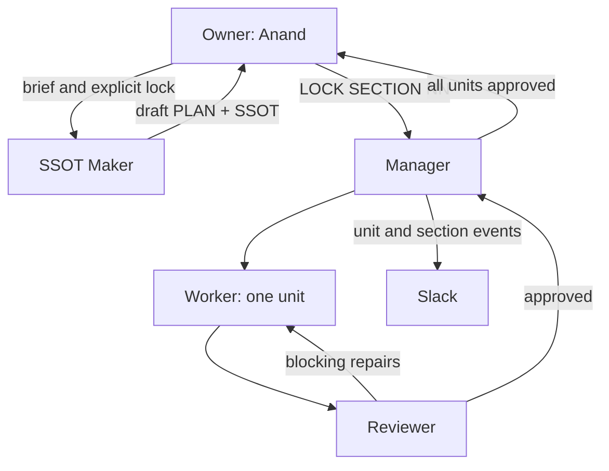

# Journey with AnandTech — DevOps Zero to Production

This repository contains the governed source material and agent runtime for a course that takes an absolute beginner from computer fundamentals to operating a production-style DevOps platform.

## Agent workflow



The agents are autonomous only inside a human-approved curriculum boundary:

- `docs/project_SSOT.md` is the global SSOT and contains the locked course map.
- Each `sections/<section>/SSOT.md` is a section SSOT.
- The SSOT Maker may draft and revise, but cannot lock.
- `LOCK SECTION NN` creates a lock receipt bound to the exact SSOT SHA-256.
- The Worker writes only one assigned unit.
- The Reviewer writes only its review report.
- The Manager owns workflow state, revision limits, and Slack notification idempotency.
- `ACCEPT SECTION NN` is required before planning the next section.

## Quick start

Python 3.11 or newer is required.

```bash
python -m venv .venv
source .venv/bin/activate
python -m pip install -e .
cp .env.example .env
```

Load `.env` with your preferred secret manager or shell. Do not commit it.

```bash
anandtech-agents status
anandtech-agents draft-ssot --brief "Revise the assessment strategy discussed with the owner"
anandtech-agents lock-ssot --confirmation "LOCK SECTION 00" --approved-by "Anand Raj"
anandtech-agents run-section
anandtech-agents retry-notifications
anandtech-agents accept-section --confirmation "ACCEPT SECTION 00"
```

See `workflow/README.md` for states, recovery rules, and notifications.

## Provider configuration

The runtime uses an OpenAI-compatible Chat Completions endpoint. `.env.example` shows NVIDIA NIM/Nemotron-style configuration. The model must reliably return JSON objects for the contracts in `prompts/`.

Secrets are read only from environment variables. They must never appear in prompts, SSOTs, units, reviews, workflow state, or Git history.
