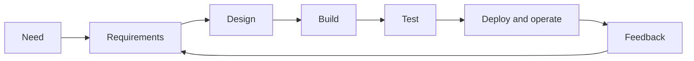
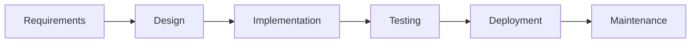
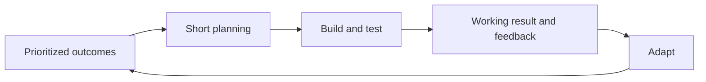
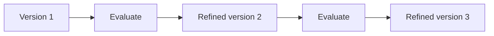
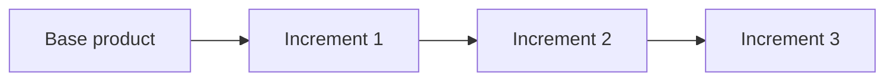
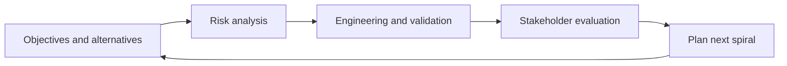
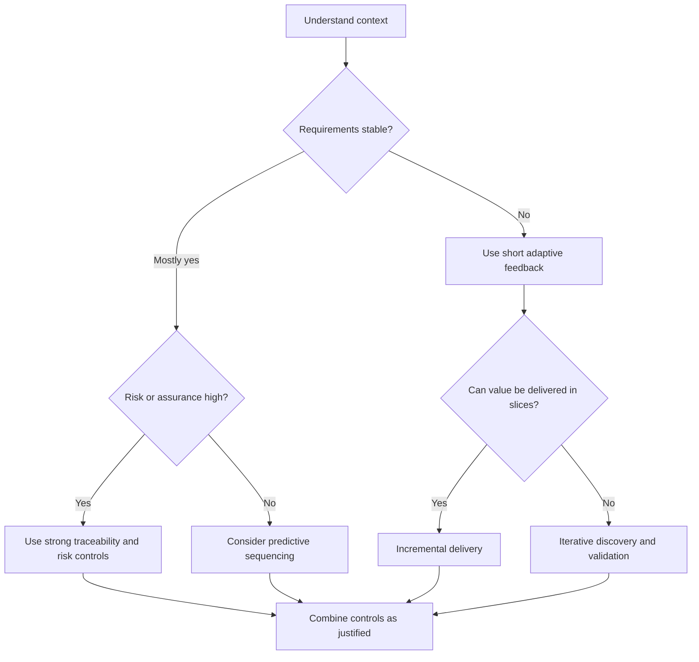

# Section 02 — Software Development Life Cycle

## Unit 04 — Popular SDLC Models and Choosing the Right Approach

### 1. Why Are We Learning This?

It is 10:30 AM at AnandTech.

The requirements, plan, risks, current architecture, and provisional ADR are now visible. Leadership asks:

> “Which SDLC model will AnandTech use permanently?”

One participant recommends Waterfall because it creates clear phases. Another recommends Agile because requirements may change. A quality engineer suggests the V-Model because testing must remain traceable. The risk manager recommends Spiral. A developer says the work should be iterative. Product wants incremental delivery.

The words sound mutually exclusive. They are not always.

Each model organizes similar lifecycle concerns differently:

```text
Requirements
Design
Development
Testing
Delivery
Operation
Feedback
```

The real decision is not which label is most fashionable. It is which arrangement best fits:

- requirement stability;
- technical uncertainty;
- risk;
- feedback needs;
- verification and traceability;
- stakeholder availability;
- compliance;
- release constraints;
- team capability.

AnandTech decides not to declare one universal winner. The team will compare the models against the HelloWorld performance change and document a justified approach.

---

### 2. Learning Objectives

After completing this unit, you will understand:

- why multiple SDLC models exist;
- predictive and adaptive approaches;
- sequential and cyclic development;
- Waterfall;
- Agile approaches;
- Iterative development;
- Incremental development;
- the V-Model;
- the Spiral model;
- hybrid approaches;
- how feedback frequency differs across models;
- how requirement stability and technical uncertainty affect selection;
- how risk, compliance, release cadence, stakeholder access, and team capability affect selection;
- the strengths and limitations of each model;
- common model-selection mistakes;
- why no model is universally best;
- how to create `anandtech-sdlc-model-selection.md`.

---

### 3. Prerequisites

You should understand:

- AnandTech's measurable performance requirement;
- scope, dependencies, estimate ranges, and risks;
- the current HelloWorld architecture;
- ADR-001 and the bounded query/index experiment;
- the difference between a lifecycle phase and a delivery outcome.

---

### 4. One Lifecycle, Different Models

An SDLC model describes how lifecycle activities are ordered, repeated, governed, and connected by feedback.



Different models change:

- how much is defined up front;
- when working software appears;
- how often feedback occurs;
- how change is handled;
- where risk analysis happens;
- how development and testing relate.

A model is not a guarantee of quality. Poor requirements, weak engineering, missing ownership, and ignored evidence can damage any model.

---

### 5. Predictive and Adaptive Approaches

#### 5.1 Predictive

A predictive approach defines substantial scope, sequence, cost, and schedule before execution.

Useful when:

- requirements are stable;
- technology is understood;
- formal approvals are important;
- change is expensive;
- contractual deliverables are fixed.

#### 5.2 Adaptive

An adaptive approach plans in shorter horizons and changes direction using feedback.

Useful when:

- requirements evolve;
- users can provide frequent feedback;
- uncertainty is high;
- increments can be delivered safely.

These are ends of a spectrum, not absolute categories.

---

### 6. Sequential and Cyclic Flow

Sequential flow moves through major phases primarily once.

```text
Requirements → Design → Build → Test → Release
```

Cyclic flow repeats some or all activities:

```text
Plan → Design → Build → Test → Learn
  ↑                              ↓
  └──────────────────────────────┘
```

Even a sequential project may revisit an earlier phase. Even an adaptive project needs architectural constraints, planning, documentation, and release controls.

---

### 7. Waterfall Model

Waterfall organizes work into substantially sequential phases. A phase is completed and reviewed before the next major phase begins.



#### 7.1 Strengths

- clear phase boundaries;
- defined deliverables and approvals;
- easier contractual milestone mapping;
- strong documentation and traceability potential;
- useful when change is limited and requirements are stable.

#### 7.2 Limitations

- working-system feedback may arrive late;
- wrong assumptions can survive for long periods;
- changes may require formal rework across completed phases;
- late integration can reveal expensive problems.

#### 7.3 AnandTech Fit

Pure Waterfall is weak for the performance change because the actual improvement depends on measurement and experimentation. However, its explicit approval and evidence discipline may remain useful for production release decisions.

---

### 8. Agile Approaches

Agile is a family of adaptive approaches guided by values such as collaboration, working software, customer involvement, and responding to change. It is not one fixed process.



#### 8.1 Strengths

- frequent feedback;
- changing requirements can be incorporated;
- working increments appear earlier;
- risks can be discovered through short cycles;
- close stakeholder collaboration.

#### 8.2 Limitations

- requires available decision-makers;
- weak discipline can become unplanned churn;
- architectural or compliance needs can be neglected if “Agile” is misunderstood;
- frequent increments still require integration, security, operation, and recovery.

#### 8.3 AnandTech Fit

Short experiments and reviews fit the uncertain performance work. AnandTech should not use Agile as permission to skip traceability, risk review, or production readiness.

---

### 9. Iterative Model

Iterative development creates a version, evaluates it, and repeatedly refines the same capability.



For HelloWorld:

```text
Iteration 1: Measure and tune query
Iteration 2: Test index and write impact
Iteration 3: Refine configuration and diagnostics
```

#### Strengths

- learning changes later decisions;
- uncertainty reduces progressively;
- early versions expose assumptions.

#### Limitations

- repeated refinement may continue without clear completion rules;
- architecture can degrade if changes are not integrated deliberately;
- scope and decision criteria must remain visible.

---

### 10. Incremental Model

Incremental development delivers the product in usable slices, with each increment adding capability.



Example:

```text
Increment 1: Faster exact-ID search
Increment 2: Better no-result diagnostics
Increment 3: Search performance dashboard
```

#### Strengths

- useful value can arrive earlier;
- smaller scope is easier to understand and test;
- later increments can use feedback from earlier ones.

#### Limitations

- increments need compatible architecture and interfaces;
- an early increment may be locally useful while broader system risks remain;
- slicing by technical layer can produce no usable outcome.

---

### 11. Iterative vs Incremental

These terms describe different ideas.

| Iterative | Incremental |
|---|---|
| Refines an existing capability repeatedly | Adds new usable capability in parts |
| Learns by revision | Delivers by expansion |
| Version 1 becomes better in Version 2 | Increment 2 adds to Increment 1 |

A project can be both:

```text
Deliver a small search improvement
    = incremental

Measure and refine that improvement repeatedly
    = iterative
```

---

### 12. V-Model

The V-Model pairs development-definition activities with corresponding verification and validation activities.

```text
Requirements            Acceptance testing
      \                  /
   System design      System testing
        \              /
   Component design  Integration testing
          \          /
             Coding
```

The left side defines and decomposes. The bottom implements. The right side integrates and verifies against earlier definitions.

Typical relationships:

| Definition activity | Corresponding evidence |
|---|---|
| Business/user requirements | Acceptance testing |
| System requirements/design | System testing |
| Architecture/component design | Integration testing |
| Detailed design | Unit testing |

#### 12.1 Strengths

- testing is planned early;
- strong traceability;
- clear relationship between definition and evidence;
- useful where assurance and formal verification are important.

#### 12.2 Limitations

- can become rigid if interpreted as one-pass delivery;
- late working-system feedback remains possible;
- documentation can become ceremonial if not connected to evidence.

#### 12.3 AnandTech Fit

The performance requirement, design decision, test strategy, and production evidence benefit from V-Model-style traceability, even if the complete project is delivered iteratively.

---

### 13. Spiral Model

The Spiral model organizes work into repeated risk-driven cycles. Each cycle evaluates objectives, alternatives, risks, engineering work, and the next decision.



#### 13.1 Strengths

- risk receives explicit attention in every cycle;
- prototypes and experiments reduce uncertainty;
- suitable for high-risk, complex, or novel work;
- allows different engineering approaches in different cycles.

#### 13.2 Limitations

- requires risk-analysis skill;
- governance can be complex;
- expensive for small, low-risk work;
- cycles need explicit exit and decision criteria.

#### 13.3 AnandTech Fit

The bounded index PoC has a risk-driven shape, but adopting a full formal Spiral process for one small performance improvement would be excessive.

---

### 14. Hybrid Approaches

A hybrid combines practices from more than one model to match context.

Example for AnandTech:

```text
Iterative discovery and PoC
        +
Incremental delivery of a bounded improvement
        +
V-Model-style traceability from requirement to test
        +
Formal production approval and rollback control
```

A hybrid is justified only when each borrowed practice solves a defined need.

Weak hybrid:

```text
All Waterfall documents
+ all Agile meetings
+ no feedback improvement
```

That adds ceremony instead of capability.

---

### 15. Feedback Frequency

Feedback delay changes risk.

| Feedback pattern | Consequence |
|---|---|
| Late integrated feedback | Wrong assumptions survive longer |
| Frequent technical feedback | Integration and behavior problems appear earlier |
| Frequent user feedback | Value and usability assumptions are tested |
| Risk-driven feedback | Major uncertainty is addressed before full commitment |
| Traceability-driven evidence | Tests remain connected to definitions |

The useful frequency depends on the cost of obtaining feedback and the cost of being wrong.

---

### 16. Requirement Stability

When requirements are stable and formally controlled, predictive planning may be useful.

When requirements are uncertain or discovery-based, shorter adaptive cycles reduce the cost of misunderstanding.

For HelloWorld:

- correctness and authorization requirements are relatively stable;
- the solution is uncertain;
- the actual performance bottleneck required discovery;
- the acceptance threshold can be measured;
- production release remains controlled.

This mixed context supports a hybrid.

---

### 17. Technical Uncertainty

Technical uncertainty asks whether the team knows how to satisfy the requirement.

High uncertainty suggests:

- prototypes;
- spikes or PoCs;
- short iterations;
- early integration;
- risk review;
- reversible decisions.

Low uncertainty may support more detailed up-front planning.

Uncertainty is not the same as complexity. A technically simple change can still have uncertain production behavior.

---

### 18. Risk Exposure

High-consequence risks may require stronger review, evidence, and traceability even when the work is iterative.

Examples:

- protected account data;
- irreversible schema change;
- safety-critical behavior;
- regulatory reporting;
- large outage potential.

An adaptive model does not remove governance. It can make risk evidence arrive sooner.

---

### 19. Verification and Traceability

The model should support links among:

```text
Need → Requirement → Design → Change → Test → Release → Production evidence
```

The V-Model makes this relationship explicit. Agile, Iterative, Incremental, Spiral, or hybrid delivery can also preserve it.

Traceability is a capability, not exclusive property of one model.

---

### 20. Compliance and Documentation

Regulated or contractual work may require:

- approved baselines;
- separation of duties;
- evidence retention;
- traceability;
- formal verification;
- controlled changes.

These needs may favor structured controls, but they do not necessarily require one large Waterfall release. Documentation and evidence can be produced continuously when governance accepts that approach.

---

### 21. Release Cadence

A model should fit how value can be safely released.

- A physical embedded device may have expensive release cycles.
- A web service may support smaller releases.
- A database migration may need careful compatibility stages.
- A regulated release may require formal evidence.

Frequent development iterations do not automatically require exposing every iteration to users.

---

### 22. Stakeholder Availability

Adaptive delivery depends on timely feedback.

If product owners, users, security reviewers, or specialists are unavailable, decisions wait or assumptions replace feedback.

A model must reflect actual collaboration capacity, not only desired meeting schedules.

---

### 23. Team Capability

Model selection should consider whether the team can:

- plan and deliver small slices;
- automate useful checks;
- integrate frequently;
- manage risk;
- maintain traceability;
- operate and recover increments;
- obtain stakeholder decisions.

A model that assumes unavailable capabilities becomes an aspiration, not an operating method.

---

### 24. Comparison Matrix

| Model | Primary organizing idea | Best fit | Main caution |
|---|---|---|---|
| Waterfall | Sequential phase completion | Stable requirements and formal milestones | Late feedback |
| Agile | Adaptive value delivery | Evolving needs and frequent collaboration | Can be misused to avoid discipline |
| Iterative | Repeated refinement | Learning and technical uncertainty | Endless refinement |
| Incremental | Usable delivery in slices | Early partial value | Architectural compatibility |
| V-Model | Definition paired with tests | Assurance and traceability | Rigidity if one-pass |
| Spiral | Risk-driven cycles | High-risk uncertainty | Cost and complexity |
| Hybrid | Context-specific combination | Mixed needs | Ceremony without coherence |

---

### 25. Selection Criteria

Evaluate:

```text
Requirement stability
User and stakeholder access
Technical uncertainty
Risk consequence
Traceability needs
Compliance
Architecture and dependencies
Release cost
Operational capability
Team skill
Time-to-feedback need
```

The model decision should explain trade-offs and adaptation.

---

### 26. Selection Decision Flow



This is a reasoning aid, not an automatic classifier.

---

### 27. Common Selection Mistakes

- choosing what another company uses;
- treating Agile as no planning;
- treating Waterfall as no feedback;
- confusing Iterative and Incremental;
- using V-Model documentation without real test links;
- using Spiral for low-risk routine work;
- creating a hybrid containing every ceremony;
- ignoring operational capability;
- selecting one model permanently for every type of work.

---

### 28. Failure Scenario — One Permanent Model

Leadership mandates one fixed process for:

- a small UI text change;
- a database migration;
- a high-risk identity replacement;
- an exploratory product idea.

The same approvals, cycle length, documents, and release requirements apply to all four.

Result:

- small work waits unnecessarily;
- high-risk work receives insufficient specialized analysis;
- exploratory work pretends requirements are stable;
- teams perform ceremonies without understanding their purpose.

The failure is not standardization itself. The failure is ignoring different risk and uncertainty profiles.

---

### 29. AnandTech Model Selection

For the HelloWorld improvement, AnandTech selects:

```text
Primary approach:
Iterative, incremental, risk-aware delivery

Supporting controls:
V-Model-style traceability
Formal production release and recovery review
```

Rationale:

- the performance solution requires experimentation;
- the user-visible change can remain small;
- requirements and tests need traceability;
- the current production process requires controlled release;
- a full Spiral program is excessive;
- pure Waterfall would delay experimental feedback;
- Agile values support collaboration but do not by themselves specify all required controls.

---

### 30. Practical Exercise — Match Scenarios

Choose and justify an approach for:

1. A fixed regulatory calculation with approved specifications.
2. A new user-facing idea with uncertain demand.
3. A safety-relevant system requiring test traceability.
4. A high-cost, high-uncertainty technology program.
5. A product that can deliver independent modules over time.

More than one answer may be defensible if assumptions are explicit.

---

### 31. Practical Exercise — Waterfall vs Agile

Compare both using:

```text
Requirement stability:
Feedback timing:
Stakeholder availability:
Documentation:
Change handling:
Release pattern:
Risk:
Best-fit conditions:
```

Do not conclude that either is universally superior.

---

### 32. Practical Exercise — Iterative vs Incremental

Classify:

- refining query performance across repeated experiments;
- releasing exact-ID search, then name search, then advanced filtering;
- improving the same search algorithm three times;
- adding separate report modules one by one.

Explain which examples can be both iterative and incremental.

---

### 33. Practical Exercise — Map the V-Model

Link:

- business need;
- performance requirement;
- architecture decision;
- query/index design;

with:

- acceptance testing;
- system performance testing;
- integration testing;
- unit/component testing.

Identify the required evidence for each link.

---

### 34. Practical Exercise — Evaluate Spiral

For a high-risk identity-provider replacement, define one spiral:

```text
Objectives:
Alternatives:
Top risks:
Risk-reduction experiment:
Engineering work:
Evaluation:
Go/no-go decision:
Next spiral:
```

Explain why the model may be excessive for a low-risk text change.

---

### 35. Practical Exercise — Design a Hybrid

Create a hybrid for HelloWorld containing only justified elements.

For every element state:

```text
Source model:
Practice adopted:
Problem solved:
Evidence produced:
Owner:
Ceremony avoided:
```

---

### 36. Create the Model-Selection Artifact

Create:

```text
anandtech-sdlc-model-selection.md
```

Use:

```markdown
# AnandTech SDLC Model Selection

## Decision Context
## Requirements and Constraints
## Uncertainty
## Risk and Compliance
## Stakeholder Availability
## Team and Operational Capability
## Models Considered
### Waterfall
### Agile
### Iterative
### Incremental
### V-Model
### Spiral
### Hybrid
## Comparison Matrix
## Selected Approach
## Rationale
## Practices Adopted
## Practices Not Adopted
## Feedback Cadence
## Traceability and Evidence
## Release Governance
## Review Triggers
```

---

### 37. Common Beginner Misunderstandings

#### 37.1 Agile Means No Documentation

Agile values working software more than comprehensive documentation; it does not say documentation has no value.

#### 37.2 Waterfall Never Allows Change

Real implementations can use change control and feedback, although late change may be costly.

#### 37.3 Iterative and Incremental Are Identical

Iteration refines; increment adds usable scope.

#### 37.4 V-Model Means Testing Starts After Coding

Test planning is paired with definition activities on the left side.

#### 37.5 Spiral Means Drawing a Spiral

Its defining characteristic is explicit risk-driven cycles and decisions.

#### 37.6 Hybrid Means Use Everything

A coherent hybrid adopts only practices justified by context.

#### 37.7 One Model Fits Every Project

Different risk, uncertainty, compliance, and release conditions require different operating choices.

---

### 38. Production Thinking

Production model selection should account for:

- deployment and rollback capability;
- operational readiness;
- incident response;
- security and compliance evidence;
- data migration risk;
- environment availability;
- support capacity;
- release cost;
- feedback delay;
- long-term maintenance.

A model that accelerates coding while ignoring safe production operation is incomplete.

---

### 39. Knowledge Check

#### 39.1 What does an SDLC model organize?
#### 39.2 How do predictive and adaptive approaches differ?
#### 39.3 What is the main structure of Waterfall?
#### 39.4 When can Waterfall be useful?
#### 39.5 What does Agile prioritize?
#### 39.6 Why is Agile not one fixed process?
#### 39.7 What does Iterative development do?
#### 39.8 What does Incremental development do?
#### 39.9 Can work be both iterative and incremental?
#### 39.10 What does the V-Model pair?
#### 39.11 Why is traceability useful?
#### 39.12 What makes Spiral risk-driven?
#### 39.13 When can Spiral be excessive?
#### 39.14 What is a hybrid approach?
#### 39.15 Why does requirement stability matter?
#### 39.16 How does stakeholder availability affect selection?
#### 39.17 Why does release cadence matter?
#### 39.18 What is wrong with selecting a model by popularity?
#### 39.19 Why is no model universally best?
#### 39.20 Which approach did AnandTech select and why?

---

### 40. Hands-On Challenge — Defend the Selection

Prepare a decision brief containing:

```text
Change context:
Requirement stability:
Technical uncertainty:
Risk consequence:
Compliance and traceability:
Stakeholder availability:
Release and operational capability:
Models considered:
Selected combination:
Feedback cadence:
Verification relationships:
Production governance:
Rejected practices:
Review triggers:
```

Defend the approach to both leadership and engineering without claiming that the selected model guarantees success.

---

### 41. AnandTech Story State After Unit 04

AnandTech has not selected one permanent model for every project.

For the performance improvement, the team selected:

- iterative experiments;
- incremental delivery of a bounded improvement;
- V-Model-style requirement-to-test traceability;
- risk-aware review;
- formal production release and recovery controls.

New artifact:

```text
anandtech-sdlc-model-selection.md
```

The provisional query/index ADR and current architecture remain unchanged.

---

### 42. Final Mental Model

```text
Context
    ↓
Requirement stability and uncertainty
    ↓
Risk and assurance
    ↓
Feedback and stakeholder access
    ↓
Delivery and operational capability
    ↓
Choose and adapt justified practices
    ↓
Review from evidence
```

The central lesson is:

> **Choose an SDLC model by the problem's conditions—not by fashion, ideology, or a permanent company mandate.**

---

### 43. Unit Summary

In this unit, you learned:

- models organize lifecycle activities and feedback differently;
- Waterfall emphasizes sequential phase control;
- Agile emphasizes collaboration, working results, and adaptation;
- Iterative work refines capability;
- Incremental work adds usable capability;
- the V-Model connects definitions to test evidence;
- Spiral organizes cycles around risk;
- hybrids should combine only justified practices;
- stability, uncertainty, risk, compliance, release cadence, stakeholders, and team capability affect selection;
- no model guarantees success or fits every situation;
- AnandTech selected a coherent hybrid for the performance improvement.

---

### 44. What Comes Next?

AnandTech now knows how the work will be organized and reviewed.

The next question is:

> **How should developers implement, review, integrate, document, and manage the change without creating late integration failure?**

---

# End of Unit

**Next file:** `section-02-sdlc/05-unit.md`

**Next topic:** **Development, Integration, and Change Management**

## References

- IBM, Software Development Life Cycle: <https://www.ibm.com/think/topics/sdlc>
- Agile Manifesto: <https://agilemanifesto.org/>
- Principles behind the Agile Manifesto: <https://agilemanifesto.org/principles.html>
