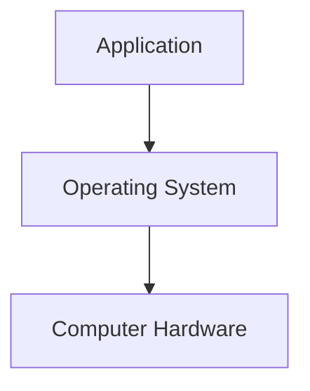
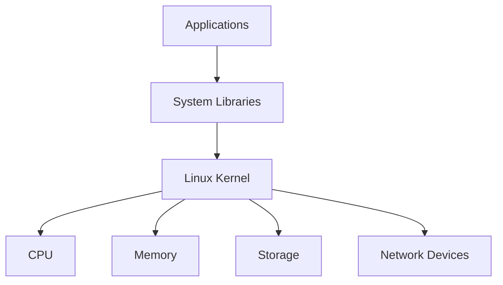
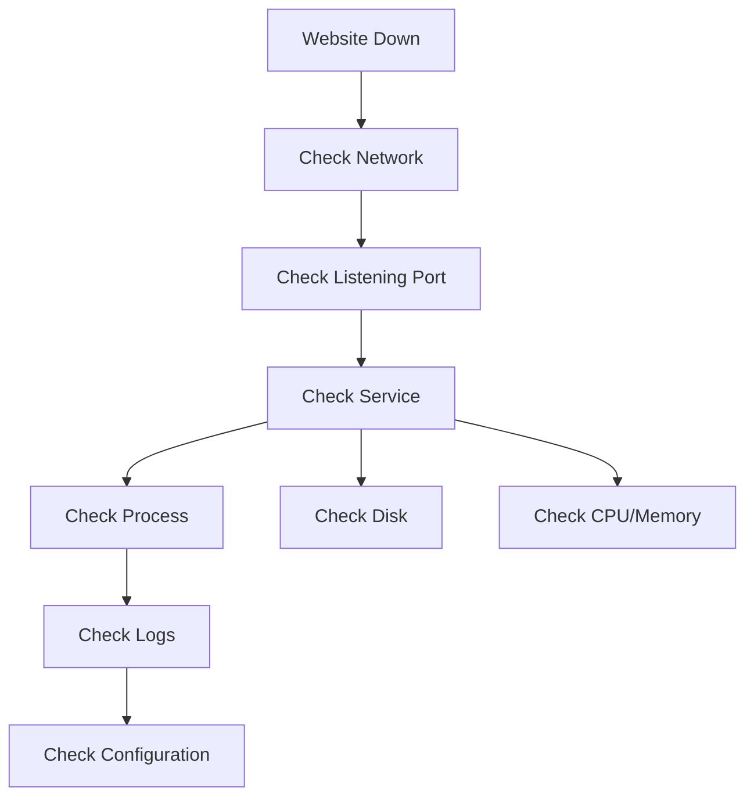
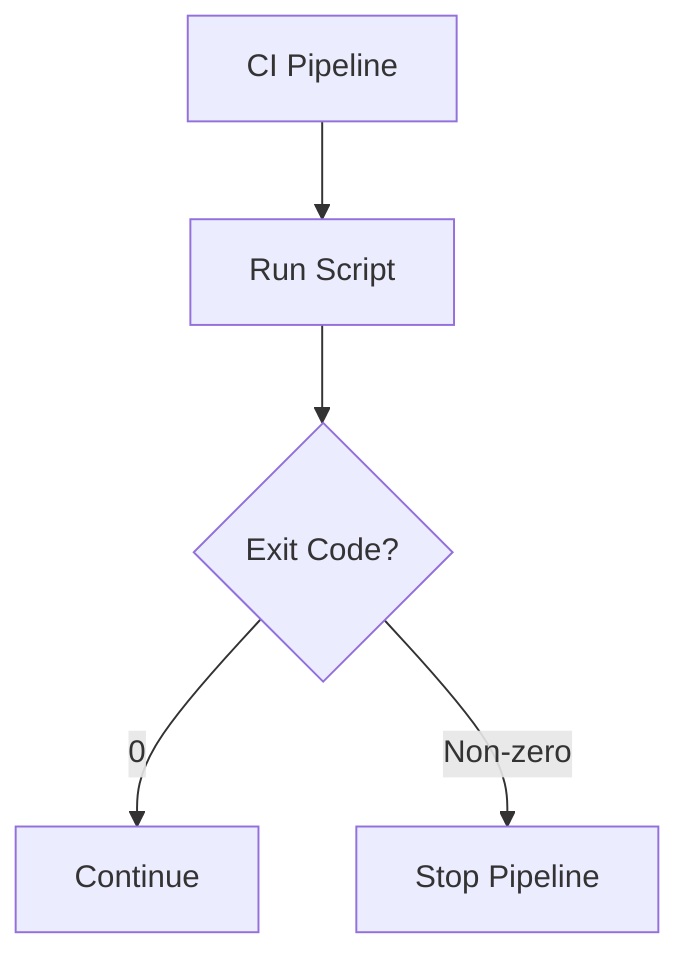
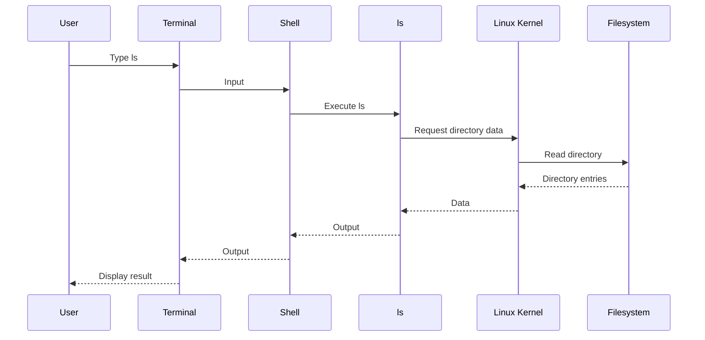
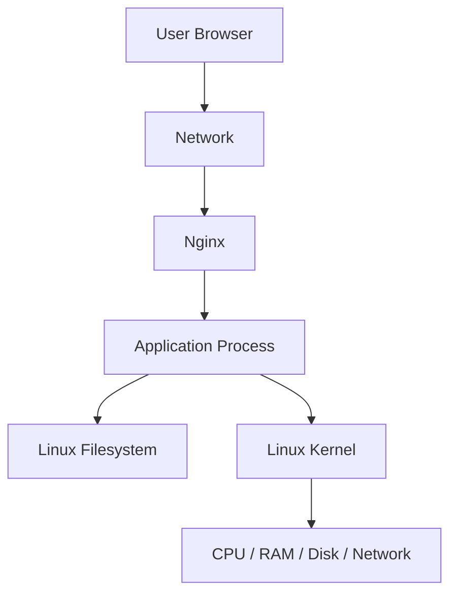

# Section 03 — Linux Foundations

## Unit 01 — Why Linux Matters in DevOps

## 1. Why Are We Learning This?

Imagine AnandTech has just hired you as a junior DevOps engineer.

On your first day, someone gives you a server.

They tell you:

> "The application is running on this machine. The website is down. Please investigate."

You connect to the server.

All you see is:

```text
$
```

No Windows desktop.

No icons.

No Start menu.

No file explorer.

Just a blinking cursor.

Your first thought might be:

> "Where is everything?"

This is where Linux begins.

Instead of clicking buttons, you communicate with the operating system using commands.

You might type:

```bash
pwd
```

and discover where you are.

Then:

```bash
ls
```

to see files.

Then:

```bash
ps
```

to see running processes.

Then:

```bash
ss -tuln
```

to inspect network ports.

Then:

```bash
systemctl status nginx
```

to determine whether the web server is running.

Suddenly, that mysterious server starts becoming understandable.

This is why Linux matters in DevOps.

Linux is not simply another operating system you should memorize commands for.

It is the environment in which an enormous amount of modern infrastructure operates.

---

# 2. Learning Objectives

After completing this unit, you will understand:

* What Linux is.
* Why Linux is important in DevOps.
* Why servers commonly use Linux.
* The relationship between Linux, applications, and hardware.
* Why DevOps engineers use the command line.
* What a Linux shell is.
* What a terminal is.
* The difference between a shell and a terminal.
* How Linux fits into a modern application stack.
* How to inspect a Linux system.
* How to identify the operating system.
* How to inspect CPU and memory.
* How to inspect disk usage.
* How to inspect running processes.
* How to inspect network information.
* How Linux connects to later topics such as Git, Jenkins, Docker, Kubernetes, and Ansible.

---

# 3. Prerequisites

**Prerequisites: None.**

You do not need previous Linux experience.

You should only be comfortable typing commands and reading text.

---

# 4. Theory

# 4.1 What Is an Operating System?

Before understanding Linux, we need to understand the problem an operating system solves.

A computer contains hardware.

For example:

```text
CPU
RAM
Disk
Network Card
Keyboard
Display
```

Applications need to use this hardware.

Imagine an application wants to save a file.

Should the application directly control the physical disk?

That would be extremely complicated.

Instead, the operating system provides an abstraction.



The application asks the operating system:

> "Please save this data."

The operating system handles the interaction with the hardware.

---

# 4.2 The Operating System as a Manager

Think of a large office.

There are:

* employees
* desks
* storage rooms
* telephones
* electricity
* security
* meeting rooms

The employees should not individually manage the building's electrical system.

A management layer coordinates access to resources.

An operating system performs a similar role.

It manages resources such as:

```text
CPU
Memory
Storage
Network
Devices
Processes
Users
Permissions
```

---

# 4.3 What Is Linux?

Linux is an operating-system kernel.

The **kernel** is the core component responsible for managing hardware and providing fundamental operating-system functionality.

This distinction is important.

People commonly say:

> "Linux is an operating system."

In everyday conversation, that is perfectly understandable.

Technically, however:

```text
Linux = Kernel
```

A complete Linux-based operating system usually contains much more:

```text
Linux Kernel
+
System Libraries
+
Shell
+
Utilities
+
Package Manager
+
Services
+
Applications
```

Together these components form a usable Linux environment.

---

# 4.4 What Does the Kernel Do?

The kernel sits between applications and hardware.



The kernel handles important responsibilities including:

* process management
* memory management
* device management
* filesystem access
* networking
* security mechanisms
* system calls

You do not normally communicate directly with hardware.

You communicate with software interfaces provided by the operating system.

---

# 4.5 What Is a Process?

Suppose you launch a web server.

The program becomes an active running instance.

That running instance is called a **process**.

For example:

```text
nginx
```

is software.

When Nginx is running:

```text
nginx process
```

exists in memory.

You can inspect processes with:

```bash
ps
```

or:

```bash
ps aux
```

You might see:

```text
USER       PID %CPU %MEM    VSZ   RSS TTY      STAT START   TIME COMMAND
root         1  0.0  0.1  ...   ... ?        Ss   ...      ... /sbin/init
root       500  0.0  0.2  ...   ... ?        Ss   ...      ... nginx
www-data   501  0.0  0.1  ...   ... ?        S    ...      ... nginx
```

Do not worry about every column yet.

We will study processes in detail later.

For now remember:

> **A process is a running instance of a program.**

---

# 4.6 Why DevOps Engineers Need to Understand Processes

Imagine the website is unavailable.

You need to determine:

```text
Is the application running?
Is Nginx running?
Is the process consuming too much CPU?
Did the process crash?
Are there too many processes?
```

Linux gives you tools to investigate.

For example:

```bash
ps aux
```

You can search for a particular process:

```bash
ps aux | grep nginx
```

The `|` character is called a pipe.

It connects the output of one command to another command.

Conceptually:

```text
ps aux
   ↓
grep nginx
   ↓
Only matching lines
```

This simple idea becomes extremely powerful later.

---

# 4.7 What Is a Server?

A server is not necessarily a special type of computer.

A server is generally a computer system that provides a service to other systems.

For example:

```text
Web Server
Database Server
DNS Server
Git Server
CI Server
File Server
Application Server
```

A laptop can technically act as a server.

A cloud virtual machine can act as a server.

A physical data-center machine can act as a server.

The important idea is the role it performs.

---

# 4.8 Why Linux Is Common on Servers

Linux became extremely important in server environments for many reasons.

Some include:

* flexibility
* stability
* strong networking capabilities
* automation support
* open-source development
* broad hardware support
* powerful command-line tools
* package management
* scripting
* strong ecosystem
* container support
* cloud compatibility

But avoid thinking:

> "Linux is always better."

Different systems have different strengths.

The important DevOps skill is understanding the environment you are operating.

---

# 4.9 Linux and DevOps

Now look at a typical DevOps environment:


Linux appears underneath many of these technologies.

Git can run on Linux.

Jenkins commonly runs on Linux.

Docker heavily relies on Linux kernel features.

Kubernetes nodes commonly run Linux.

Cloud virtual machines frequently run Linux.

Monitoring agents commonly run on Linux.

Therefore, learning Linux gives you a foundation underneath many DevOps technologies.

---

# 4.10 The DevOps Stack

Think of the technology stack as layers.

```text
┌─────────────────────────────┐
│ Applications                │
├─────────────────────────────┤
│ Containers / Kubernetes     │
├─────────────────────────────┤
│ CI/CD                       │
├─────────────────────────────┤
│ Automation                  │
├─────────────────────────────┤
│ Networking                  │
├─────────────────────────────┤
│ Linux                       │
├─────────────────────────────┤
│ Hardware / Cloud            │
└─────────────────────────────┘
```

If you skip the lower layers, higher-level tools can feel like magic.

We want to remove that magic.

---

# 4.11 GUI vs Command Line

Most desktop users interact with computers through a graphical interface.

For example:

```text
Click folder
Click file
Click application
Drag file
Open settings
```

Linux servers are often managed through a command-line interface.

For example:

```bash
cd /var/log
ls
tail -f nginx/access.log
```

The command line may initially feel harder.

But it provides enormous advantages for DevOps.

---

# 4.12 Why DevOps Engineers Love the Command Line

Imagine you need to perform the same task on 100 servers.

Using a graphical interface:

```text
Server 1 → Click
Server 2 → Click
Server 3 → Click
...
Server 100 → Click
```

This is slow.

With automation:

```bash
for server in server01 server02 server03
do
    ssh "$server" "sudo systemctl restart nginx"
done
```

The same basic operation can be automated.

This is one of the reasons command-line skills are fundamental to DevOps.

---

# 4.13 Commands Are Instructions

A command is an instruction given to the shell.

For example:

```bash
pwd
```

means:

> "Show me the current working directory."

```bash
ls
```

means:

> "List the contents of this directory."

```bash
whoami
```

means:

> "Tell me which user I am."

```bash
date
```

means:

> "Show the current date and time."

These commands are small.

But they become building blocks for automation.

---

# 4.14 Your First Linux Commands

If you have a Linux environment available, open a terminal.

Start with:

```bash
pwd
```

Example:

```text
/home/anand
```

This tells you where you currently are.

Now:

```bash
whoami
```

Example:

```text
anand
```

Now:

```bash
hostname
```

Example:

```text
dev-server
```

Now:

```bash
date
```

Example:

```text
Tue Aug 11 14:20:00 IST 2026
```

Your system will obviously show its own information.

---

# 4.15 Understanding the Prompt

You may see something like:

```text
anand@dev-server:~$
```

Let's break it apart.

```text
anand
```

is the current username.

```text
@
```

separates the username from the hostname.

```text
dev-server
```

is the hostname.

```text
:
```

separates the hostname from the current location.

```text
~
```

represents the user's home directory.

```text
$
```

usually indicates a normal user shell.

For the root user, you will commonly see:

```text
#
```

For example:

```text
root@server:~#
```

Be careful with root access.

---

# 4.16 The `root` User

Linux has a highly privileged account called:

```text
root
```

Root can perform powerful operations.

For example:

```bash
rm -rf /some/path
```

can delete large amounts of data.

A root command can also:

* modify system configuration
* create users
* change permissions
* install software
* stop services
* modify networking
* delete files

Therefore:

> **Do not use root unnecessarily.**

A common pattern is:

```bash
sudo command
```

For example:

```bash
sudo systemctl restart nginx
```

`sudo` allows an authorized user to execute a command with elevated privileges.

We will study Linux permissions and `sudo` in detail later.

---

# 4.17 Your First System Investigation

Let's imagine AnandTech gives you an unknown Linux server.

You need to identify it.

Run:

```bash
hostname
```

Then:

```bash
whoami
```

Then:

```bash
pwd
```

Then:

```bash
uname -a
```

Then:

```bash
cat /etc/os-release
```

Then:

```bash
uptime
```

Then:

```bash
free -h
```

Then:

```bash
df -h
```

Then:

```bash
ip addr
```

Then:

```bash
ps aux
```

You have just performed a basic system reconnaissance exercise.

---

# 4.18 Understanding `uname`

Run:

```bash
uname -a
```

Example:

```text
Linux dev-server 6.8.0-31-generic #31-Ubuntu SMP ... x86_64 GNU/Linux
```

This can provide information such as:

```text
Kernel name
Hostname
Kernel release
Architecture
```

A simpler command is:

```bash
uname -r
```

Example:

```text
6.8.0-31-generic
```

This tells you the kernel release.

---

# 4.19 Understanding `/etc/os-release`

Run:

```bash
cat /etc/os-release
```

You may see:

```text
PRETTY_NAME="Ubuntu 24.04 LTS"
NAME="Ubuntu"
VERSION_ID="24.04"
VERSION="24.04 LTS (Noble Numbat)"
ID=ubuntu
```

This tells you which Linux distribution you are using.

For example:

```text
Ubuntu
Debian
Rocky Linux
AlmaLinux
Fedora
Amazon Linux
```

We will study distributions in the next units.

---

# 4.20 Checking CPU Information

Run:

```bash
lscpu
```

You will see information about:

* architecture
* CPU model
* CPU count
* threads
* cores
* virtualization support

A shorter command:

```bash
nproc
```

Example:

```text
4
```

This indicates the number of available processing units reported by the system.

---

# 4.21 Checking Memory

Run:

```bash
free -h
```

Example:

```text
               total        used        free      shared
Mem:            7.7Gi       2.1Gi       3.4Gi       120Mi
Swap:           2.0Gi          0B       2.0Gi
```

The `-h` means human-readable.

Instead of:

```text
8074032
```

you may see:

```text
7.7Gi
```

which is easier for humans to read.

---

# 4.22 Checking Disk Space

Run:

```bash
df -h
```

Example:

```text
Filesystem      Size  Used Avail Use% Mounted on
/dev/sda2       100G   42G   53G  45% /
```

This tells you about filesystem disk usage.

A server with a full filesystem can experience serious problems.

For example:

```text
Disk reaches 100%
      ↓
Application cannot write files
      ↓
Logs cannot be written
      ↓
Database may fail
      ↓
Application becomes unhealthy
```

This is a common real-world operational problem.

---

# 4.23 Checking Directory Size

The `df` command tells you about filesystem usage.

To find which directories are consuming space, use:

```bash
du -sh /var/*
```

For a specific directory:

```bash
du -sh /var/log
```

Example:

```text
3.2G    /var/log
```

This can immediately help diagnose:

> "Why is my server running out of disk space?"

---

# 4.24 Checking Running Processes

Run:

```bash
ps aux
```

This can produce a long list.

To find Nginx:

```bash
ps aux | grep nginx
```

To find SSH:

```bash
ps aux | grep ssh
```

To search more generally:

```bash
ps aux | grep <process-name>
```

Remember that `grep` itself may appear in the results.

Later, we will learn cleaner techniques.

---

# 4.25 Real-Time Process Monitoring

Run:

```bash
top
```

You will see a continuously updating view.

You may see:

```text
PID USER      PR  NI    VIRT    RES    SHR S  %CPU %MEM
123 root      20   0  500000  50000  10000 S   2.0  0.6
456 www-data  20   0  800000  80000  15000 S   1.5  1.0
```

Press:

```text
q
```

to exit.

On many Linux systems you may also have:

```bash
htop
```

if it is installed.

---

# 4.26 Checking Network Interfaces

Run:

```bash
ip addr
```

or:

```bash
ip a
```

You may see:

```text
2: eth0:
    inet 192.168.1.20/24
```

This tells you that the system has a network interface with an IP address.

We will study networking deeply in **Section 04 — Linux Networking**.

For now, remember:

```text
Linux
 ↓
Network Interface
 ↓
IP Address
 ↓
Network
 ↓
Other Systems
```

---

# 4.27 Checking Listening Ports

Run:

```bash
ss -tuln
```

This displays listening TCP and UDP sockets.

You might see:

```text
Netid State  Local Address:Port
tcp   LISTEN 0.0.0.0:22
tcp   LISTEN 0.0.0.0:80
```

This suggests services may be listening on:

```text
22 → SSH
80 → HTTP
```

We will learn the networking concepts behind this later.

---

# 4.28 Checking a Service

Suppose AnandTech uses Nginx.

Check its status:

```bash
systemctl status nginx
```

If it is running, you may see:

```text
Active: active (running)
```

If it is stopped:

```text
Active: inactive (dead)
```

If it failed:

```text
Active: failed
```

This single command can immediately tell you whether the service manager believes Nginx is healthy.

---

# 4.29 The First Troubleshooting Workflow

Imagine:

> "The website is down."

Do not immediately restart everything.

Start with evidence.



A disciplined engineer investigates before changing things.

---

# 4.30 Linux as a Collection of Tools

One of Linux's greatest strengths is that it provides many small tools.

For example:

```text
pwd
ls
grep
find
sort
cut
awk
sed
ps
ss
df
du
top
systemctl
journalctl
```

Each tool solves a particular problem.

But the real power comes from combining them.

For example:

```bash
ps aux | grep nginx
```

or:

```bash
df -h | grep '/$'
```

or:

```bash
journalctl -u nginx --since "1 hour ago"
```

This philosophy is often summarized as:

> Build powerful workflows by combining small tools.

---

# 4.31 Pipes

The pipe operator is:

```text
|
```

It sends the output of one command to another command.

Example:

```bash
ls -l | less
```

Conceptually:


Another example:

```bash
ps aux | grep nginx
```

Conceptually:


This concept will become extremely important when writing shell scripts.

---

# 4.32 Redirecting Output

Linux allows command output to be redirected.

For example:

```bash
echo "Hello DevOps" > hello.txt
```

Now inspect the file:

```bash
cat hello.txt
```

Output:

```text
Hello DevOps
```

The `>` operator redirects output into a file.

Be careful:

```bash
echo "New text" > hello.txt
```

replaces the existing contents.

To append:

```bash
echo "Another line" >> hello.txt
```

Now:

```bash
cat hello.txt
```

might show:

```text
Hello DevOps
Another line
```

---

# 4.33 Standard Output and Standard Error

Linux commands can produce:

```text
stdout
stderr
```

Standard output is normal command output.

Standard error is error output.

For example:

```bash
ls /does-not-exist
```

may produce an error message.

You can redirect standard output:

```bash
command > output.txt
```

You can redirect standard error:

```bash
command 2> error.txt
```

You can redirect both:

```bash
command > output.txt 2>&1
```

These concepts become extremely useful in automation and CI/CD logs.

---

# 4.34 Exit Codes

Linux commands usually return an exit status.

A successful command commonly returns:

```text
0
```

A failure commonly returns a non-zero value.

Try:

```bash
true
echo $?
```

You should get:

```text
0
```

Now:

```bash
false
echo $?
```

You should get a non-zero value, commonly:

```text
1
```

The special variable:

```bash
$?
```

contains the exit status of the previous command.

This concept is extremely important for automation.

---

# 4.35 Why Exit Codes Matter in CI/CD

Imagine Jenkins runs:

```bash
./run-tests.sh
```

If the tests fail but the script still returns:

```text
0
```

Jenkins may think:

> "Everything succeeded."

That is dangerous.

A properly designed script should return a failure status when the operation fails.

Conceptually:



We will return to this concept repeatedly throughout the book.

---

# 4.36 Environment Variables

Linux processes can receive environment variables.

Try:

```bash
echo $HOME
```

You may see:

```text
/home/anand
```

Try:

```bash
echo $USER
```

You may see:

```text
anand
```

Try:

```bash
echo $PATH
```

You may see something like:

```text
/usr/local/sbin:/usr/local/bin:/usr/sbin:/usr/bin:/sbin:/bin
```

The `PATH` variable tells the shell where to look for executable commands.

---

# 4.37 Why `PATH` Matters

When you type:

```bash
git
```

the shell searches directories in `PATH`.

Conceptually:

```text
git
 ↓
Search PATH directories
 ↓
/usr/bin/git
 ↓
Execute
```

You can find the location with:

```bash
which git
```

or, on many systems:

```bash
command -v git
```

This becomes useful when troubleshooting:

> "Why does my terminal say command not found?"

---

# 4.38 Linux and Automation

Imagine you need to configure 100 servers.

Manually:

```text
Server 1
Server 2
Server 3
...
Server 100
```

Automation changes the model:

```text
Instructions
     ↓
Automation Tool
     ↓
100 Servers
```

Tools we will encounter later include:

```text
Shell Scripts
Ansible
Jenkins
Terraform
Docker
Kubernetes
```

Many of these ultimately depend on operating-system capabilities.

---

# 4.39 Linux and Git

Git is deeply integrated into modern software development.

A typical workflow might look like:

```bash
git clone https://example.com/project.git
cd project
git status
git add .
git commit -m "Add feature"
git push
```

Where does this happen?

Often:

```text
Developer Laptop
       ↓
Linux/macOS/Windows
```

and CI servers may execute:

```text
Linux
 ↓
Git
 ↓
Build Tools
 ↓
Tests
```

Therefore Linux command-line knowledge will make Git and CI/CD easier to understand.

---

# 4.40 Linux and Jenkins

A Jenkins agent may execute commands such as:

```bash
git checkout
npm install
npm test
docker build
docker push
```

Those commands execute inside an environment.

Understanding that environment matters.

If Jenkins reports:

```text
command not found
```

you need to understand:

```text
PATH
users
permissions
packages
filesystem
processes
environment variables
```

Linux knowledge becomes practical rather than theoretical.

---

# 4.41 Linux and Docker

Docker containers commonly rely on Linux kernel capabilities.

The host provides fundamental operating-system functionality.

Conceptually:

```text
┌─────────────────────────────┐
│ Container A                 │
├─────────────────────────────┤
│ Container B                 │
├─────────────────────────────┤
│ Container C                 │
├─────────────────────────────┤
│ Docker Engine               │
├─────────────────────────────┤
│ Linux Kernel                │
├─────────────────────────────┤
│ Hardware / VM               │
└─────────────────────────────┘
```

Understanding Linux makes container behavior easier to reason about.

---

# 4.42 Linux and Kubernetes

A Kubernetes cluster typically contains nodes.

A simplified architecture:

```text
Kubernetes Cluster
       │
       ├── Node 1
       │     └── Linux
       │
       ├── Node 2
       │     └── Linux
       │
       └── Node 3
             └── Linux
```

The Kubernetes abstraction hides many details.

But underneath the abstraction, operating-system concepts still matter.

When troubleshooting Kubernetes nodes, engineers may eventually inspect:

```bash
ps
top
df
free
ss
journalctl
systemctl
ip
```

Linux fundamentals remain useful even at advanced levels.

---

# 4.43 A Beginner's Mental Model

For now, remember this model:

```text
You
 ↓
Terminal
 ↓
Shell
 ↓
Linux Kernel
 ↓
Hardware
```

When you run:

```bash
ls
```

the process is roughly:

```text
You type command
      ↓
Terminal receives input
      ↓
Shell interprets command
      ↓
Shell starts program
      ↓
Program interacts with OS
      ↓
Kernel interacts with hardware/resources
      ↓
Output returns
      ↓
Terminal displays result
```

We will study each layer in greater detail.

---

# 5. How It Works Internally

Let's follow a simple command:

```bash
ls
```

## Step 1 — You Type the Command

You enter:

```text
ls
```

and press Enter.

---

## Step 2 — The Terminal Receives Input

The terminal provides an interface for interacting with the shell.

---

## Step 3 — The Shell Interprets the Command

The shell determines what `ls` means.

It searches locations listed in:

```bash
echo $PATH
```

---

## Step 4 — The `ls` Program Executes

The program requests directory information from the operating system.

---

## Step 5 — The Kernel Handles the Request

The kernel provides access to the filesystem.

---

## Step 6 — Results Are Returned

The output is passed back through the shell.

---

## Step 7 — The Terminal Displays It

You see something like:

```text
Documents
Downloads
projects
```

The simplified flow is:



This is a simplified model, but it provides a useful mental picture.

---

# 5.1 System Calls

Applications do not normally manipulate hardware directly.

They use operating-system interfaces called **system calls**.

Examples include operations related to:

```text
Files
Processes
Memory
Networking
Devices
```

Conceptually:

```text
Application
    ↓
System Call
    ↓
Linux Kernel
    ↓
Hardware
```

You do not need to memorize system calls yet.

Later, when learning advanced Linux and containers, this concept becomes increasingly useful.

---

# 5.2 Why This Matters for DevOps

Suppose Docker behaves unexpectedly.

You may eventually need to understand:

```text
Processes
Namespaces
Networking
Filesystems
Permissions
Resource limits
Kernel features
```

These are operating-system concepts.

That is why we begin here.

---

# 6. Practical Lab — Meet Your Linux System

Create a file called:

```text
linux-system-info.sh
```

Put the following into it:

```bash
#!/bin/bash

echo "======================================"
echo "       Linux System Information"
echo "======================================"

echo
echo "User:"
whoami

echo
echo "Hostname:"
hostname

echo
echo "Current Directory:"
pwd

echo
echo "Kernel:"
uname -r

echo
echo "Operating System:"
grep '^PRETTY_NAME=' /etc/os-release

echo
echo "CPU Count:"
nproc

echo
echo "Memory:"
free -h

echo
echo "Disk:"
df -h /

echo
echo "Uptime:"
uptime

echo
echo "======================================"
```

Make it executable:

```bash
chmod +x linux-system-info.sh
```

Run it:

```bash
./linux-system-info.sh
```

You have just created your first Linux administration script.

---

# 6.1 Understanding the Script

Let's break it down.

```bash
#!/bin/bash
```

This tells the system to execute the script using Bash.

Then:

```bash
echo "User:"
```

prints text.

This:

```bash
whoami
```

prints the current user.

This:

```bash
hostname
```

prints the hostname.

This:

```bash
uname -r
```

prints the kernel version.

This:

```bash
free -h
```

prints memory information.

And:

```bash
df -h /
```

prints disk usage for the root filesystem.

---

# 6.2 A More Advanced Version

Now let's make the script slightly more useful.

```bash
#!/bin/bash

set -e

echo "======================================"
echo "       AnandTech Server Report"
echo "======================================"

echo
echo "Hostname:"
hostname

echo
echo "User:"
whoami

echo
echo "Operating System:"
. /etc/os-release
echo "$PRETTY_NAME"

echo
echo "Kernel:"
uname -r

echo
echo "Architecture:"
uname -m

echo
echo "CPU:"
nproc

echo
echo "Memory:"
free -h

echo
echo "Disk:"
df -h /

echo
echo "IP Addresses:"
hostname -I

echo
echo "Listening Ports:"
ss -tuln

echo
echo "Uptime:"
uptime

echo
echo "======================================"
echo "Report complete."
echo "======================================"
```

Run:

```bash
chmod +x anandtech-server-report.sh
./anandtech-server-report.sh
```

This is the beginning of operational automation.

---

# 6.3 Saving the Report

You can save the output:

```bash
./anandtech-server-report.sh > server-report.txt
```

Then inspect it:

```bash
cat server-report.txt
```

Or:

```bash
less server-report.txt
```

You can also append:

```bash
./anandtech-server-report.sh >> server-history.txt
```

This begins introducing the concept of collecting operational information.

---

# 7. Practical Lab — Find a Service

If your Linux system has Nginx installed, run:

```bash
systemctl status nginx
```

If Nginx is not installed, you can skip this exercise for now.

If it is running, try:

```bash
systemctl is-active nginx
```

Then:

```bash
systemctl is-enabled nginx
```

Then:

```bash
ss -tuln | grep ':80'
```

You may see a listener on port 80.

Now you have connected several concepts:

```text
systemd
   ↓
Nginx process
   ↓
Listening socket
   ↓
HTTP port
```

That is already the beginning of server troubleshooting.

---

# 8. Practical Lab — Investigate a "Broken" Server

Imagine AnandTech reports:

> "The website is down."

You are given a Linux server.

Do not restart anything yet.

Run these commands in order:

```bash
hostname
```

```bash
uptime
```

```bash
df -h
```

```bash
free -h
```

```bash
ps aux | head
```

```bash
ss -tuln
```

If Nginx exists:

```bash
systemctl status nginx
```

Then:

```bash
journalctl -u nginx --no-pager -n 50
```

Create a short incident report:

```text
Hostname:
Uptime:
Disk usage:
Memory usage:
Nginx status:
Port 80:
Recent errors:
Initial hypothesis:
```

This is an important habit:

> **Collect evidence before making changes.**

---

# 9. Troubleshooting Guide

## Problem: `command not found`

Example:

```text
bash: htop: command not found
```

Possible causes:

* program is not installed
* executable is not in `PATH`
* typo in command

Check:

```bash
command -v htop
```

If nothing is returned, it may not be installed.

---

## Problem: `Permission denied`

Example:

```text
bash: ./script.sh: Permission denied
```

Check permissions:

```bash
ls -l script.sh
```

You may need:

```bash
chmod +x script.sh
```

Then:

```bash
./script.sh
```

We will study permissions properly later.

---

## Problem: `sudo: command not found`

This can occur in unusual minimal environments.

Do not immediately assume the system is broken.

Check:

```bash
command -v sudo
```

and identify the operating system:

```bash
cat /etc/os-release
```

Package-management instructions depend on the distribution.

---

## Problem: Nginx Is Not Running

Check:

```bash
systemctl status nginx
```

Then inspect logs:

```bash
journalctl -u nginx --no-pager -n 100
```

Do not blindly run:

```bash
systemctl restart nginx
```

before understanding why it stopped.

---

# 10. Common Beginner Mistakes

## Mistake 1 — Memorizing Commands Without Understanding Them

Do not attempt to memorize hundreds of commands.

Understand what problem each command solves.

---

## Mistake 2 — Using `sudo` for Everything

Do not automatically type:

```bash
sudo
```

before every command.

Use elevated privileges only when required.

---

## Mistake 3 — Running Destructive Commands Without Understanding Them

Be extremely careful with commands involving:

```bash
rm
chmod
chown
dd
mkfs
fdisk
iptables
```

We will discuss them safely and progressively.

---

## Mistake 4 — Changing Configuration Before Collecting Evidence

A good troubleshooting pattern is:

```text
Observe
 ↓
Measure
 ↓
Hypothesize
 ↓
Test
 ↓
Change
 ↓
Verify
```

Not:

```text
Problem
 ↓
Restart everything
```

---

## Mistake 5 — Ignoring Exit Codes

Automation depends heavily on success and failure signals.

Always remember:

```bash
echo $?
```

---

# 11. Command Reference

| Command                 | Purpose                          |
| ----------------------- | -------------------------------- |
| `pwd`                 | Show current directory           |
| `whoami`              | Show current user                |
| `hostname`            | Show system hostname             |
| `date`                | Show date/time                   |
| `uname -a`            | Show kernel/system information   |
| `uname -r`            | Show kernel version              |
| `cat /etc/os-release` | Show distribution information    |
| `nproc`               | Show CPU processing units        |
| `lscpu`               | Show CPU details                 |
| `free -h`             | Show memory usage                |
| `df -h`               | Show filesystem usage            |
| `du -sh`              | Show directory/file size         |
| `ps aux`              | Show processes                   |
| `top`                 | Monitor processes                |
| `ip addr`             | Show network interfaces          |
| `ss -tuln`            | Show listening sockets           |
| `systemctl status`    | Show service status              |
| `journalctl`          | View system/service logs         |
| `echo`                | Print text                       |
| `grep`                | Search text                      |
| `which`               | Find executable                  |
| `command -v`          | Find command                     |
| `chmod`               | Change permissions               |
| `sudo`                | Execute with elevated privileges |

---

# 12. Knowledge Check

Before moving on, answer these questions.

### Question 1

What is Linux technically?

A. A web server
B. A programming language
C. A kernel
D. A database

---

### Question 2

What does this command show?

```bash
pwd
```

---

### Question 3

What does this command show?

```bash
free -h
```

---

### Question 4

What does this do?

```bash
ps aux | grep nginx
```

---

### Question 5

What does the pipe symbol do?

```text
|
```

---

### Question 6

What does exit code `0` generally indicate?

---

### Question 7

Why should you avoid using `root` unnecessarily?

---

### Question 8

Why is Linux knowledge useful for Docker and Kubernetes?

---

# 13. Mini Challenge — Become the AnandTech Server Detective

Create a script named:

```text
server-detective.sh
```

Your script should print:

```text
====================================
 AnandTech Server Detective
====================================

Hostname:
User:
OS:
Kernel:
CPU:
Memory:
Disk:
IP Address:
Uptime:

====================================
```

You should use commands rather than manually typing the values.

A possible starting structure is:

```bash
#!/bin/bash

echo "===================================="
echo " AnandTech Server Detective"
echo "===================================="

echo
echo "Hostname:"
hostname

echo
echo "User:"
whoami

# Continue here...
```

Your challenge is to complete the remaining fields yourself.

Try not to copy the previous script directly.

Look at the command reference and figure out which commands provide the required information.

---

# 14. Production Thinking

At the beginner level, you might think:

> "Linux is where I run commands."

At the production level, the mental model becomes:

> "Linux is an operating environment that manages processes, resources, networking, storage, users, permissions, and services—and my DevOps automation interacts with all of those components."

That difference matters.

When a CI pipeline fails, you may need to understand:

```text
Process
 ↓
Environment
 ↓
Filesystem
 ↓
Permissions
 ↓
Network
 ↓
Service
 ↓
Logs
```

When a Docker container fails:

```text
Container
 ↓
Runtime
 ↓
Kernel
 ↓
Resources
 ↓
Network
 ↓
Filesystem
```

When Kubernetes reports a node problem:

```text
Kubernetes
 ↓
Container Runtime
 ↓
Linux
 ↓
CPU / Memory / Disk / Network
```

The higher-level tools do not eliminate the lower-level system.

They build abstractions on top of it.

---

# 15. The AnandTech Story Continues

Our original AnandTech application looked like:

```text
HTML
 ↓
Nginx
 ↓
Linux Server
```

Now we understand that this simple architecture actually contains many layers:



As we progress through this book, we will peel back each layer.

Eventually we will automate the entire system.

---

# 16. What Comes Next?

We now know that Linux is important.

But Linux is not one single product.

There are many Linux distributions.

You may have heard names such as:

```text
Ubuntu
Debian
Fedora
Rocky Linux
AlmaLinux
Red Hat Enterprise Linux
Amazon Linux
Arch Linux
```

Why are there so many?

Who creates them?

What is the difference between Ubuntu and Debian?

Why does one server use:

```bash
apt
```

while another uses:

```bash
dnf
```

Why do organizations choose one distribution over another?

Those questions lead us to the next part of our Linux journey.

---

# 17. Unit Summary

In this unit, you learned:

```text
Linux
 ↓
Operating-system foundation
 ↓
Processes
 ↓
Memory
 ↓
Storage
 ↓
Networking
 ↓
Services
 ↓
Users
 ↓
Automation
```

You also executed real commands:

```bash
pwd
whoami
hostname
uname
cat /etc/os-release
nproc
lscpu
free -h
df -h
du
ps
top
ip addr
ss
systemctl
journalctl
```

You created your first Bash system-information script.

Most importantly, you learned the first principle of Linux administration:

> **Do not treat the server as a black box. Inspect it, understand it, and then change it.**

---

---

# End of Unit

**Next file:** `section-03-linux-foundations/02-unit.md`

**Next topic:** **Unit 02 — Filesystem Navigation, Files, Directories, and Metadata**
