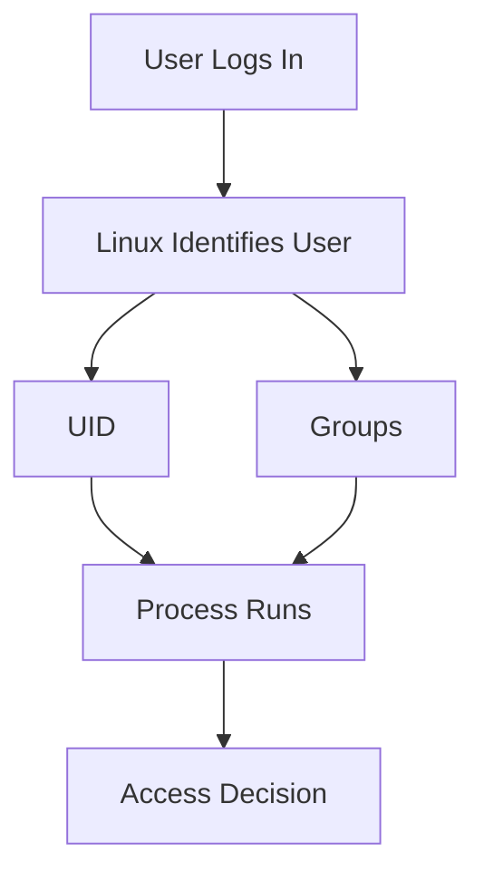
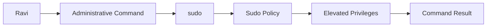
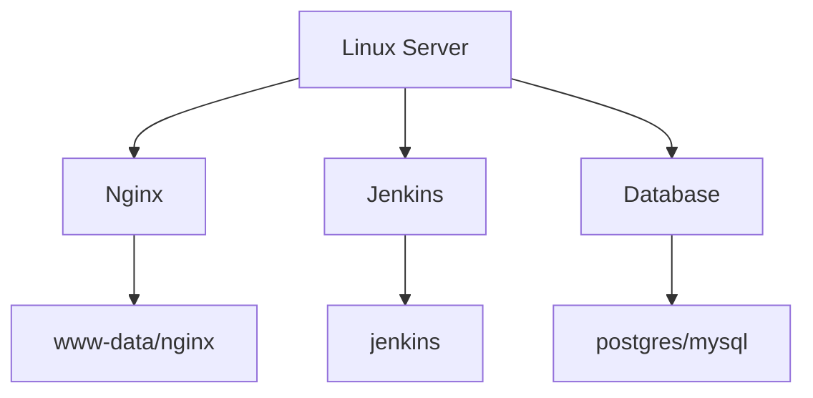
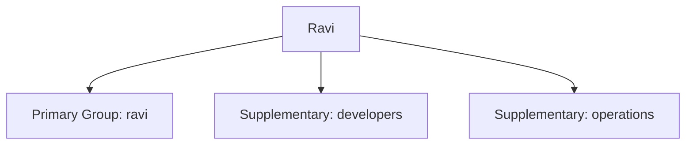
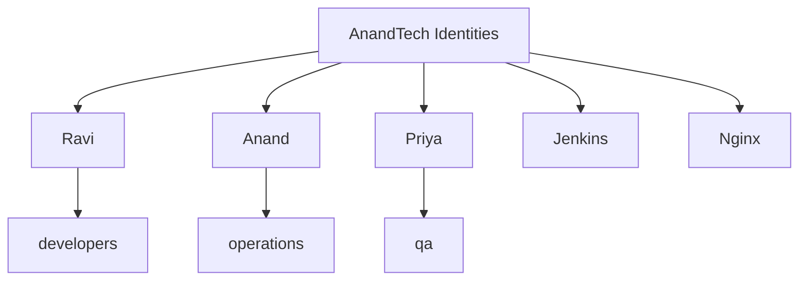
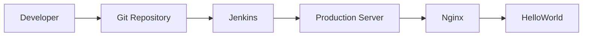
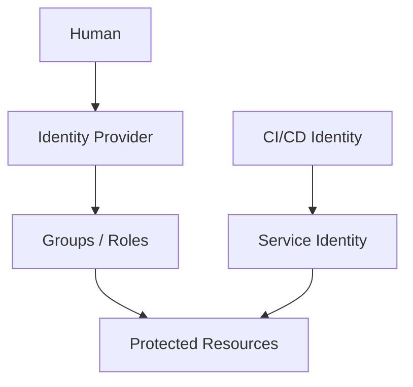

# Section 03 — Linux Foundations

## Unit 08 — Users, Groups, Account Databases, Service Identities, and Lifecycle

## 1. Why Are We Learning This?

It is 2:00 AM at AnandTech.

The HelloWorld application is running on a Linux server.

Ravi, the junior administrator, connects to the server and notices something strange.

The application files belong to:

```text
root
```

The deployment process runs as:

```text
jenkins
```

The Nginx web server runs as:

```text
www-data
```

And Ravi is logged in as:

```text
ravi
```

Then he asks:

> "Why are there so many users? Why can't Jenkins modify this file? Why can Nginx read it but not change it? Why does `sudo` ask for permission?"

These questions lead us to one of Linux's most important security concepts:

> **Identity.**

Linux does not simply ask:

> "What command are you running?"

It also asks:

> **"Who are you?"**

And then:

> **"What are you allowed to do?"**

This gives us the basic security model:

```text
User
  ↓
Identity
  ↓
Groups
  ↓
Ownership
  ↓
Permissions
  ↓
Access
```

Understanding users and groups is essential before learning Linux permissions.

---

# 2. Learning Objectives

After completing this unit, you will be able to:

* Understand Linux user accounts.
* Understand Linux groups.
* Explain the difference between users and groups.
* Understand root.
* Understand service accounts.
* Identify the current user.
* Inspect user information.
* Inspect group membership.
* Create users.
* Modify users.
* Delete users.
* Create groups.
* Add users to groups.
* Remove users from groups.
* Understand `/etc/passwd`.
* Understand `/etc/shadow`.
* Understand `/etc/group`.
* Understand UIDs and GIDs.
* Understand system users.
* Understand login shells.
* Understand `sudo`.
* Troubleshoot common user and group problems.
* Build a basic user-management script.

---

# 3. Prerequisites

You should understand:

* Basic Linux commands.
* Files and directories.
* The Linux filesystem hierarchy.
* Basic command-line navigation.

You should have access to a Linux environment where you can safely create test users.

> **Important:** User-management commands can modify the operating system. Perform the exercises in a disposable VM, container, or lab server whenever possible.

---

# 4. The Basic Idea: Linux Needs Identity

Imagine an apartment building.

There are:

```text
People
Apartments
Keys
Security rules
```

The building manager needs to know:

* Who are you?
* Which apartment do you belong to?
* Which rooms can you enter?
* Which areas are restricted?

Linux works similarly.

A Linux system has:

```text
Users
Groups
Files
Ownership
Permissions
Processes
```

The operating system uses identity information to decide what a process can access.

---

# 5. What Is a User?

A user is an identity recognized by the Linux operating system.

For example:

```text
anand
ravi
jenkins
www-data
ubuntu
```

A user account can have:

* username
* numeric UID
* primary group
* supplementary groups
* home directory
* login shell
* password information
* account status

A simplified user record looks like:

```text
Username
   ↓
UID
   ↓
Primary Group
   ↓
Supplementary Groups
   ↓
Home Directory
   ↓
Shell
```

---

# 6. What Is a Group?

A group is a collection of users.

Imagine AnandTech has:

```text
developers
operations
database
security
```

Users can belong to one or more groups.

For example:

```text
Ravi
 ├── developers
 └── operations

Anand
 ├── developers
 └── security

Priya
 └── operations
```

Groups make permissions easier to manage.

Instead of giving access individually to 50 developers, you can give access to:

```text
developers
```

and put the developers into that group.

---

# 7. User vs Group

| Concept             | Purpose                           |
| ------------------- | --------------------------------- |
| User                | Represents an identity            |
| Group               | Organizes identities              |
| UID                 | Numeric user identifier           |
| GID                 | Numeric group identifier          |
| Primary group       | Main group associated with a user |
| Supplementary group | Additional group membership       |

Think:

```text
User = person/identity

Group = team
```

---

# 8. The First Command: `whoami`

Run:

```bash
whoami
```

Example:

```text
ravi
```

This answers:

> Which user am I currently operating as?

This should become one of your first troubleshooting commands.

When connected to a server, don't assume your identity.

Check it.

---

# 9. `id`

Run:

```bash
id
```

Example:

```text
uid=1001(ravi) gid=1001(ravi) groups=1001(ravi),27(sudo),1002(developers)
```

This tells us a lot.

We can interpret it as:

```text
uid=1001(ravi)
```

The user is:

```text
ravi
```

with UID:

```text
1001
```

The primary group is:

```text
ravi
```

with GID:

```text
1001
```

The user also belongs to:

```text
sudo
developers
```

---

# 10. UID — User ID

Linux internally identifies users using numbers.

For example:

```text
ravi → UID 1001
```

The username is mainly a human-friendly representation.

Internally, the kernel cares about numeric identities.

Think:

```text
Human:
ravi

Linux:
1001
```

This becomes especially important when working with:

* containers
* NFS
* file ownership
* automation
* Kubernetes
* shared storage

---

# 11. Why Numeric IDs Matter

Suppose a file is owned by:

```text
UID 1001
```

One machine might display:

```text
ravi
```

Another machine may have a completely different username mapped to UID 1001.

This is why distributed systems must think carefully about identity.

For example:

```text
Server A:
UID 1001 → ravi

Server B:
UID 1001 → deployment
```

The number is what the filesystem fundamentally uses.

---

# 12. GID — Group ID

Groups also have numeric IDs.

Example:

```text
developers → GID 1002
```

Run:

```bash
id ravi
```

You might see:

```text
uid=1001(ravi)
gid=1001(ravi)
groups=1001(ravi),1002(developers)
```

Now we can map:

```text
User:
ravi → UID 1001

Primary group:
ravi → GID 1001

Additional group:
developers → GID 1002
```

---

# 13. `groups`

Run:

```bash
groups
```

Example:

```text
ravi sudo developers
```

You can also inspect another user:

```bash
groups ravi
```

This is useful when troubleshooting:

> "Why can't this user access the deployment directory?"

First check group membership.

---

# 14. `who`

Run:

```bash
who
```

This shows users currently logged into the system.

Example:

```text
ravi     pts/0    2026-08-11 10:20
anand    pts/1    2026-08-11 10:35
```

This can be useful during operational investigations.

---

# 15. `w`

Another useful command:

```bash
w
```

It can provide information about:

* logged-in users
* login time
* terminal
* idle time
* current activity

Example:

```text
USER   TTY    FROM       LOGIN@   IDLE   WHAT
ravi   pts/0  10.0.0.20 10:20    2m     vim deploy.sh
```

This gives more context than `who`.

---

# 16. Linux Identity Flow

A simplified model:



This identity information follows the process.

That becomes extremely important when we later discuss:

* permissions
* services
* Docker
* Kubernetes
* CI/CD agents

---

# 17. Root — The Superuser

Linux has a special account:

```text
root
```

Root traditionally has UID:

```text
0
```

Check:

```bash
id root
```

You will typically see:

```text
uid=0(root)
```

Root has extremely powerful privileges.

Think of root as the master administrator.

---

# 18. Why Root Is Dangerous

Suppose a normal user runs:

```bash
rm /important/file
```

The system may deny the operation.

Root may be able to run:

```bash
rm /important/file
```

successfully.

That power is necessary for administration.

But it is also dangerous.

A typo as root can become a production incident.

For example:

```bash
rm -rf /some/important/path/*
```

can cause serious damage.

Therefore:

> Use elevated privileges only when necessary.

---

# 19. `sudo`

Instead of logging in directly as root, Linux systems commonly use:

```bash
sudo
```

For example:

```bash
sudo systemctl restart nginx
```

This means approximately:

> Execute this command with elevated privileges according to the sudo policy.

You remain logged in as your normal user.

---

# 20. Why `sudo` Is Better Than Constant Root Access

Imagine Ravi is working on a server.

He needs:

```text
normal work
+
occasional administration
```

Instead of:

```text
root shell all day
```

he can use:

```text
ravi
 ↓
sudo
 ↓
specific administrative command
```

This reduces accidental exposure to privileged operations.

---

# 21. Check `sudo`

Try:

```bash
sudo whoami
```

If permitted, the result is:

```text
root
```

Notice:

```bash
whoami
```

might return:

```text
ravi
```

while:

```bash
sudo whoami
```

returns:

```text
root
```

The command is being executed with elevated identity.

---

# 22. Understanding `sudo` Conceptually



The exact implementation is more sophisticated, but this is the right mental model.

---

# 23. Where Linux Stores User Information

Several important files are involved.

| File             | Purpose                                   |
| ---------------- | ----------------------------------------- |
| `/etc/passwd`  | User account information                  |
| `/etc/shadow`  | Password hashes/account aging information |
| `/etc/group`   | Group information                         |
| `/etc/gshadow` | Group security information                |

These files are fundamental to traditional local Linux account management.

---

# 24. `/etc/passwd`

View it:

```bash
cat /etc/passwd
```

A line may look like:

```text
ravi:x:1001:1001:Ravi Raj:/home/ravi:/bin/bash
```

The fields are separated by `:`.

The structure is approximately:

```text
username
:
password placeholder
:
UID
:
GID
:
GECOS/comment
:
home directory
:
login shell
```

---

# 25. Understanding `/etc/passwd`

For:

```text
ravi:x:1001:1001:Ravi Raj:/home/ravi:/bin/bash
```

we can read:

| Field          | Value          |
| -------------- | -------------- |
| Username       | `ravi`       |
| Password field | `x`          |
| UID            | `1001`       |
| GID            | `1001`       |
| Comment        | `Ravi Raj`   |
| Home           | `/home/ravi` |
| Shell          | `/bin/bash`  |

The `x` does not mean the password itself is stored there.

On modern systems, password hashes are generally stored in `/etc/shadow`.

---

# 26. `/etc/shadow`

Try:

```bash
sudo cat /etc/shadow
```

You may see lines like:

```text
ravi:$6$...:...
```

This file contains sensitive authentication information.

Do not casually expose or copy its contents.

Permissions are intentionally restrictive.

Check:

```bash
ls -l /etc/shadow
```

Typically, access is restricted to privileged users or a tightly controlled group depending on the distribution.

---

# 27. Why Separate `/etc/passwd` and `/etc/shadow`?

Historically, password information was stored in `/etc/passwd`.

But `/etc/passwd` needs to be readable by many programs.

That created a security problem.

So modern systems commonly separate:

```text
Public-ish account metadata
        ↓
/etc/passwd

Sensitive password information
        ↓
/etc/shadow
```

This is an example of security through separation.

---

# 28. `/etc/group`

View:

```bash
cat /etc/group
```

A line might look like:

```text
developers:x:1002:ravi,anand
```

Meaning:

```text
Group name:
developers

GID:
1002

Members:
ravi
anand
```

Groups provide a scalable way to manage access.

---

# 29. Creating a Group

Use:

```bash
sudo groupadd developers
```

Check:

```bash
getent group developers
```

Example:

```text
developers:x:1002:
```

`getent` is useful because it queries the configured account database rather than reading only a local file directly.

---

# 30. Why `getent` Is Useful

Run:

```bash
getent passwd ravi
```

and:

```bash
getent group developers
```

This can work with local files and, depending on system configuration, centralized identity services.

This becomes important in enterprise Linux environments.

A company may use:

* LDAP
* Active Directory integration
* SSSD
* other identity providers

So:

> Don't assume every identity comes directly from `/etc/passwd`.

---

# 31. Creating a User

On many Linux systems:

```bash
sudo useradd ravi
```

But creating a useful human login usually requires additional configuration.

A common pattern is:

```bash
sudo useradd -m -s /bin/bash ravi
```

Here:

```text
-m → create home directory
-s → specify login shell
```

Then set a password:

```bash
sudo passwd ravi
```

You will be prompted to enter the password.

---

# 32. Creating a Test User

For this chapter, let's create:

```text
devopsstudent
```

Run:

```bash
sudo useradd -m -s /bin/bash devopsstudent
```

Set a password if your lab requires password-based login:

```bash
sudo passwd devopsstudent
```

Then:

```bash
id devopsstudent
```

You should see the new identity.

---

# 33. Verify the Home Directory

Run:

```bash
ls -ld /home/devopsstudent
```

You may see:

```text
drwx------ 2 devopsstudent devopsstudent ... /home/devopsstudent
```

The exact permissions vary by distribution and configuration.

The important idea is:

```text
/home/devopsstudent
        ↓
owned by devopsstudent
```

---

# 34. Create a User with a Specific Home Directory

You can specify:

```bash
sudo useradd \
    -m \
    -d /home/ravi \
    -s /bin/bash \
    ravi
```

Options:

```text
-m → create home
-d → home directory
-s → shell
```

Always check the command's documentation:

```bash
man useradd
```

---

# 35. `adduser` vs `useradd`

On some Linux distributions, you may encounter:

```bash
adduser
```

and:

```bash
useradd
```

They are not identical interfaces.

`useradd` is a lower-level account creation utility.

`adduser` may provide a more interactive, distribution-specific interface.

For example, on Debian-family systems:

```bash
sudo adduser ravi
```

may guide you through several account setup steps.

As a DevOps engineer, you should recognize both.

---

# 36. Modifying a User

Suppose Ravi needs another group.

Use:

```bash
sudo usermod ...
```

For example:

```bash
sudo usermod -aG developers ravi
```

The important option is:

```text
-aG
```

which means:

```text
-a → append
-G → supplementary groups
```

---

# 37. Why `-a` Matters

This is a famous Linux administration trap.

Suppose Ravi currently belongs to:

```text
sudo
```

and you want to add:

```text
developers
```

Correct:

```bash
sudo usermod -aG developers ravi
```

Without `-a`:

```bash
sudo usermod -G developers ravi
```

you may replace the user's supplementary group list instead of appending to it.

Therefore remember:

```text
usermod -aG group user
```

when adding supplementary membership.

---

# 38. Verify Group Membership

Run:

```bash
id ravi
```

or:

```bash
groups ravi
```

You should see:

```text
developers
```

However, if Ravi is already logged in, the current session may not immediately reflect newly added group membership.

A new login session may be required.

---

# 39. `newgrp`

In some situations, you can use:

```bash
newgrp developers
```

to start a shell with a changed group context.

Check:

```bash
id
```

This can be useful in lab environments, although logging out and back in is often clearer for normal user sessions.

---

# 40. Removing a User from a Group

The exact command depends on your distribution and tools.

A common approach is:

```bash
sudo gpasswd -d ravi developers
```

Then verify:

```bash
groups ravi
```

Another approach is to use `usermod` while carefully rebuilding the supplementary group list.

Always understand the current memberships before modifying them.

---

# 41. Deleting a User

Basic:

```bash
sudo userdel ravi
```

This removes the account.

It may not remove the home directory.

To remove the home directory as well:

```bash
sudo userdel -r ravi
```

Be careful.

Deleting a user can affect:

* files
* running processes
* scheduled jobs
* application ownership
* SSH access
* automation

---

# 42. Before Deleting a User

Check:

```bash
id ravi
```

Check processes:

```bash
ps -u ravi
```

Find files owned by the user:

```bash
sudo find / -user ravi 2>/dev/null
```

Check scheduled tasks if applicable.

Then determine whether the account is still used.

Production account deletion should be a controlled change.

---

# 43. User Deletion Is Not the Same as File Deletion

Suppose:

```text
ravi → UID 1001
```

owns:

```text
/opt/app/data.txt
```

If the user is deleted, the filesystem may still have files owned by numeric UID:

```text
1001
```

The username mapping disappears.

You may then see ownership represented numerically.

This is another reason UID management matters in infrastructure.

---

# 44. Finding Files by User

Find files owned by Ravi:

```bash
sudo find / -user ravi 2>/dev/null
```

Find files by UID:

```bash
sudo find / -uid 1001 2>/dev/null
```

This is useful during account cleanup.

---

# 45. System Users and Service Accounts

Not every user is a human.

Linux applications often run under dedicated accounts.

Examples may include:

```text
www-data
nginx
apache
postgres
mysql
jenkins
```

These are often service identities.

The purpose is isolation.

Instead of running everything as root:

```text
root
 ↓
everything
```

we prefer:

```text
nginx    → Nginx
postgres → PostgreSQL
jenkins  → Jenkins
```

---

# 46. Why Service Accounts Matter

Imagine Nginx has a vulnerability.

If Nginx runs as root:

```text
Nginx compromise
      ↓
root privileges
      ↓
potentially entire system
```

If it runs under a restricted service account:

```text
Nginx compromise
      ↓
limited account
      ↓
smaller blast radius
```

This is a fundamental security principle:

> **Least privilege.**

---

# 47. Service Identity Architecture



Each service can operate with its own identity.

This becomes especially important later in:

* Docker
* Kubernetes
* cloud IAM
* DevSecOps

---

# 48. Login Shells

A user has a shell configured in `/etc/passwd`.

For example:

```text
/bin/bash
```

Common shells include:

```text
/bin/bash
/bin/sh
/bin/zsh
/bin/fish
```

Some service accounts may use:

```text
/usr/sbin/nologin
```

or:

```text
/bin/false
```

This can prevent interactive login.

---

# 49. Why Service Accounts May Not Need Shell Access

Suppose the `nginx` user only needs to run Nginx.

There is usually no reason for an administrator to SSH directly into the server as:

```text
nginx
```

Therefore its shell can be configured to prevent interactive login.

Conceptually:

```text
Human user:
ravi
 ↓
/bin/bash
 ↓
Interactive shell

Service user:
nginx
 ↓
/usr/sbin/nologin
 ↓
No interactive shell
```

This reduces attack surface.

---

# 50. Inspect a User's Shell

Run:

```bash
getent passwd ravi
```

and:

```bash
getent passwd nginx
```

The final field shows the configured shell.

You can also inspect:

```bash
echo "$SHELL"
```

for your current environment.

---

# 51. Changing a User's Shell

Use:

```bash
sudo usermod -s /bin/bash ravi
```

Or to disable interactive login:

```bash
sudo usermod -s /usr/sbin/nologin serviceuser
```

The exact `nologin` path can vary by distribution.

Check first:

```bash
which nologin
```

---

# 52. Locked Accounts

Linux can also lock account authentication.

For example:

```bash
sudo passwd -l username
```

and unlock:

```bash
sudo passwd -u username
```

Be careful:

> Locking a password is not necessarily equivalent to disabling every possible form of account access.

SSH keys, existing sessions, service behavior, and other authentication mechanisms must be considered.

---

# 53. Account Expiration

Linux can manage account expiration.

Inspect:

```bash
sudo chage -l username
```

You may see:

```text
Last password change
Password expires
Password inactive
Account expires
Minimum number of days
Maximum number of days
```

This is useful for controlled account lifecycle management.

---

# 54. Setting Account Expiration

For example:

```bash
sudo chage -E 2026-12-31 username
```

This sets an account expiration date.

Organizations can use such controls for:

* temporary contractors
* temporary project accounts
* training accounts
* emergency access

---

# 55. Password Aging

You can inspect:

```bash
sudo chage -l ravi
```

Password policies should be designed according to organizational security requirements rather than blindly applying arbitrary expiration rules.

Modern security programs generally focus on strong authentication, MFA where possible, credential protection, and risk-based controls.

---

# 56. Primary vs Supplementary Groups

This distinction is important.

Suppose:

```text
ravi
```

has:

```text
Primary group:
ravi

Supplementary groups:
developers
operations
```

Conceptually:



When files are created, the file's group ownership is influenced by the process's group context and filesystem rules.

We'll explore that in the next unit on permissions.

---

# 57. Group-Based Access

Suppose AnandTech has:

```text
/opt/helloworld/
```

and wants developers to read application code.

Instead of:

```text
Ravi
Anand
Priya
Amit
...
```

individually managing every user, create:

```text
developers
```

Then:

```text
developers
    ↓
access to application resources
```

When Priya joins:

```bash
sudo usermod -aG developers priya
```

When she leaves:

```bash
sudo gpasswd -d priya developers
```

The permission model scales with the organization.

---

# 58. Group Design

Don't create groups randomly.

Good group design reflects responsibilities.

For example:

```text
developers
operations
deployers
database-admins
security
monitoring
```

But avoid excessive group complexity.

A useful principle:

> Create groups around access requirements, not around arbitrary organizational labels.

For example:

```text
production-deployers
```

may be more useful for access control than:

```text
engineering-team
```

if the permission is specifically deployment access.

---

# 59. The AnandTech Scenario

AnandTech now has:

```text
Ravi      → developer
Anand     → operations
Priya     → QA
Jenkins   → CI/CD service
Nginx     → web server
```

We can represent this as:



Later, permissions will determine what these identities can actually access.

---

# 60. Creating a DevOps Lab Group

Let's build a safe example.

Create:

```bash
sudo groupadd devops
```

Verify:

```bash
getent group devops
```

Create a lab user:

```bash
sudo useradd -m -s /bin/bash devopsstudent
```

Add the user:

```bash
sudo usermod -aG devops devopsstudent
```

Verify:

```bash
id devopsstudent
```

You should see the `devops` group.

---

# 61. Create a Shared Lab Directory

Create:

```bash
sudo mkdir -p /opt/devops-lab
```

Change group:

```bash
sudo chown root:devops /opt/devops-lab
```

Check:

```bash
ls -ld /opt/devops-lab
```

You may see something similar to:

```text
drwxr-xr-x root devops /opt/devops-lab
```

The group now identifies the team associated with the directory.

Permissions will determine what the group can actually do.

That is our next unit.

---

# 62. Understanding Ownership

A Linux file generally has an owner and group.

Run:

```bash
ls -l
```

Example:

```text
-rw-r----- 1 ravi developers 1240 app.conf
```

We can interpret:

```text
owner → ravi
group → developers
```

This gives us the foundation for:

```text
owner permissions
group permissions
other permissions
```

---

# 63. A Simple Access Model

Think of a file as a building.

There are three audiences:

```text
Owner
Group
Everyone else
```

Linux permissions can then answer:

```text
Can the owner read?
Can the owner write?
Can the owner execute?

Can the group read?
Can the group write?
Can the group execute?

Can others read?
Can others write?
Can others execute?
```

We'll explore the exact permission bits in the next unit.

---

# 64. User Management Command Matrix

| Task                    | Command                    |
| ----------------------- | -------------------------- |
| Current user            | `whoami`                 |
| Identity details        | `id`                     |
| User groups             | `groups`                 |
| Logged-in users         | `who`                    |
| User activity           | `w`                      |
| Find user record        | `getent passwd user`     |
| Find group record       | `getent group group`     |
| Create user             | `useradd`                |
| Create home             | `useradd -m`             |
| Set shell               | `useradd -s`             |
| Set password            | `passwd`                 |
| Modify user             | `usermod`                |
| Add group               | `usermod -aG group user` |
| Create group            | `groupadd`               |
| Remove group membership | `gpasswd -d user group`  |
| Delete user             | `userdel`                |
| Delete user + home      | `userdel -r`             |
| Account aging           | `chage`                  |
| Lock password           | `passwd -l`              |
| Unlock password         | `passwd -u`              |
| Elevated command        | `sudo command`           |

---

# 65. Troubleshooting Matrix

| Problem                        | First Commands                |
| ------------------------------ | ----------------------------- |
| Who am I?                      | `whoami`, `id`            |
| Why can't I access something?  | `id`, `groups`, `ls -l` |
| Does a user exist?             | `getent passwd user`        |
| Does a group exist?            | `getent group group`        |
| Who owns a file?               | `ls -l file`                |
| Who owns many files?           | `find path -user user`      |
| Is the account locked?         | `passwd -S user`            |
| What is the shell?             | `getent passwd user`        |
| When does account expire?      | `chage -l user`             |
| Who is logged in?              | `who`, `w`                |
| What processes belong to user? | `ps -u user`                |

---

# 66. Practical Lab — Create a Team

Create three users:

```bash
sudo useradd -m -s /bin/bash developer1
sudo useradd -m -s /bin/bash developer2
sudo useradd -m -s /bin/bash tester1
```

Create groups:

```bash
sudo groupadd developers
sudo groupadd testers
```

Add memberships:

```bash
sudo usermod -aG developers developer1
sudo usermod -aG developers developer2
sudo usermod -aG testers tester1
```

Verify:

```bash
id developer1
id developer2
id tester1
```

---

# 67. Practical Lab — Create an Operations Team

Create:

```bash
sudo groupadd operations
```

Add:

```bash
sudo usermod -aG operations developer1
```

Verify:

```bash
groups developer1
```

You should now have multiple group memberships.

Conceptually:

```text
developer1
├── primary group
├── developers
└── operations
```

This prepares us for group-based permissions.

---

# 68. Practical Lab — Inspect the Account Database

Run:

```bash
getent passwd developer1
```

Then:

```bash
getent group developers
```

Then:

```bash
id developer1
```

Compare what each command tells you.

You should start seeing that Linux provides multiple views of the same identity system.

---

# 69. Practical Lab — Service Account

Create a service-style user:

```bash
sudo useradd \
    --system \
    --no-create-home \
    --shell /usr/sbin/nologin \
    helloworld
```

Inspect:

```bash
getent passwd helloworld
```

Check:

```bash
id helloworld
```

This account is intended to represent an application rather than a human administrator.

---

# 70. Why Service Accounts Improve Security

Imagine the HelloWorld service runs as:

```text
root
```

A vulnerability could potentially expose the entire machine.

Instead:

```text
helloworld
```

can be restricted to the directories and resources it needs.

Later:

```text
Docker
   ↓
container user

Kubernetes
   ↓
securityContext

Cloud
   ↓
IAM role
```

The same principle continues across the DevOps stack:

> **Run workloads with only the privileges they need.**

---

# 71. User Management Script

Let's create a small automation example.

Create:

```bash
nano ~/devops-lab/scripts/create-devops-user.sh
```

Add:

```bash
#!/bin/bash

set -u

USERNAME="${1:-}"
GROUPNAME="devops"

if [ -z "$USERNAME" ]; then
    echo "Usage: $0 <username>"
    exit 1
fi

if id "$USERNAME" >/dev/null 2>&1; then
    echo "ERROR: User '$USERNAME' already exists."
    exit 1
fi

if ! getent group "$GROUPNAME" >/dev/null 2>&1; then
    echo "Creating group: $GROUPNAME"
    sudo groupadd "$GROUPNAME"
fi

echo "Creating user: $USERNAME"

sudo useradd \
    -m \
    -s /bin/bash \
    "$USERNAME"

if [ $? -ne 0 ]; then
    echo "ERROR: Failed to create user."
    exit 1
fi

sudo usermod -aG "$GROUPNAME" "$USERNAME"

if [ $? -ne 0 ]; then
    echo "ERROR: Failed to add user to group."
    exit 1
fi

echo
echo "User created successfully."
echo "Username: $USERNAME"
echo "Groups:"
id "$USERNAME"
```

Make executable:

```bash
chmod +x ~/devops-lab/scripts/create-devops-user.sh
```

Run:

```bash
~/devops-lab/scripts/create-devops-user.sh labuser
```

---

# 72. What This Script Demonstrates

This simple script introduces several DevOps ideas:

```text
Input validation
       ↓
Idempotency awareness
       ↓
Identity lookup
       ↓
Conditional creation
       ↓
Privilege escalation
       ↓
Exit-code checking
       ↓
Verification
```

It isn't production-ready yet.

But it is already moving beyond manually typing commands.

---

# 73. Idempotency

Notice:

```bash
if id "$USERNAME" >/dev/null 2>&1; then
```

The script checks whether the user already exists.

Why?

Imagine CI/CD runs:

```text
Deployment 1
Deployment 2
Deployment 3
Deployment 4
```

If every run blindly creates resources, the system becomes unpredictable.

Automation should often be safe to run repeatedly.

This idea is called:

> **Idempotency.**

We will revisit it extensively when we learn Ansible and infrastructure as code.

---

# 74. Production Thinking: Human vs Machine Identity

Modern DevOps systems contain many identities.

```text
Human Users
   ↓
Developers
Operations
Security

Machine Identities
   ↓
Jenkins
GitHub Actions
Kubernetes
Applications
Monitoring agents
Cloud workloads
```

These identities should not all have the same privileges.

A mature environment thinks in terms of:

```text
Who?
 ↓
Needs what?
 ↓
For how long?
 ↓
On which resources?
 ↓
With what privileges?
```

This is the foundation of access control.

---

# 75. Identity in the CI/CD Pipeline

Consider our future AnandTech pipeline:



Now assign identities:

```text
Developer → ravi
Jenkins → jenkins
Server administration → operations
Nginx → www-data/nginx
Application → helloworld
```

The question becomes:

> What should each identity be allowed to do?

That is the bridge to permissions.

---

# 76. Security Principle: Least Privilege

The principle is simple:

> Give an identity only the permissions it actually needs.

Bad:

```text
Jenkins
   ↓
root access everywhere
```

Better:

```text
Jenkins
   ↓
specific deployment permissions
   ↓
specific application directory
```

Bad:

```text
Nginx
   ↓
write access to everything
```

Better:

```text
Nginx
   ↓
read application files
   ↓
write only required runtime locations
```

Least privilege reduces the blast radius of mistakes and compromises.

---

# 77. Security Principle: Separation of Duties

Imagine one person can:

```text
write code
approve code
deploy production
change security controls
```

That can create excessive concentration of power.

A mature organization may separate responsibilities:

```text
Developer
   ↓
Code

Reviewer
   ↓
Approval

CI
   ↓
Build/Test

Deployment System
   ↓
Production

Operations
   ↓
Runtime
```

DevOps does not mean removing all controls.

It means automating the flow while designing sensible controls.

---

# 78. Identity Flow in Production

A simplified production model:



Later, cloud IAM and Kubernetes RBAC will make this model more sophisticated.

---

# 79. Unit Challenge

Create the following structure conceptually:

```text
AnandTech
├── developers
│   ├── developer1
│   └── developer2
├── testers
│   └── tester1
├── operations
│   └── ops1
└── services
    ├── helloworld
    └── nginx
```

Then answer:

1. Which identities are human?
2. Which identities are service accounts?
3. Which users should belong to `developers`?
4. Which users should belong to `operations`?
5. Should Nginx have an interactive login shell?
6. Should Jenkins run as root?
7. Should every developer have production deployment privileges?
8. Why are groups useful?

There may be multiple valid answers, but justify your decisions.

---

# 80. Knowledge Check

### Question 1

What does:

```bash
whoami
```

tell you?

### Question 2

What does:

```bash
id
```

show?

### Question 3

What is a UID?

### Question 4

What is a GID?

### Question 5

What is the purpose of a group?

### Question 6

Why is root powerful?

### Question 7

Why is `sudo` preferable to working as root all the time?

### Question 8

What information is stored in `/etc/passwd`?

### Question 9

Why is `/etc/shadow` protected?

### Question 10

What does:

```bash
usermod -aG developers ravi
```

do?

### Question 11

Why are service accounts useful?

### Question 12

What is least privilege?

---

# 81. Quick Reference

## Identity

```bash
whoami
id
groups
who
w
```

## User lookup

```bash
getent passwd username
id username
```

## Group lookup

```bash
getent group groupname
```

## Create

```bash
sudo useradd -m -s /bin/bash username
sudo groupadd groupname
```

## Modify

```bash
sudo usermod -aG groupname username
sudo usermod -s /bin/bash username
```

## Password

```bash
sudo passwd username
sudo passwd -l username
sudo passwd -u username
```

## Account lifecycle

```bash
sudo chage -l username
sudo userdel username
sudo userdel -r username
```

## Privilege

```bash
sudo command
sudo -i
```

Use an interactive root shell only when genuinely necessary.

---

# 82. Final Mental Model

Remember this hierarchy:

```text
                    Linux System
                         |
              +----------+----------+
              |                     |
            Users                 Groups
              |                     |
             UID                   GID
              |                     |
              +----------+----------+
                         |
                      Process
                         |
                    File Access
                         |
                     Permissions
```

Users answer:

> **Who are you?**

Groups answer:

> **Which teams/access sets are you part of?**

UID/GID answer:

> **How does Linux identify those identities internally?**

`sudo` answers:

> **Can you temporarily perform a privileged operation?**

Service accounts answer:

> **Which identity should a workload run as?**

Least privilege answers:

> **How much access should that identity receive?**

---

# 83. The Journey Continues

Ravi now understands identities.

He can answer:

```text
Who am I?
       ↓
whoami

What is my UID?
       ↓
id

What groups am I in?
       ↓
groups

Who owns this identity?
       ↓
getent passwd

What group exists?
       ↓
getent group

Can I perform an administrative operation?
       ↓
sudo
```

But one major question remains.

Suppose we have:

```text
-rw-r----- 1 ravi developers app.conf
```

What does:

```text
-rw-r-----
```

actually mean?

Why can Ravi read and write it?

Why can developers read it?

Why can't everyone else read it?

And why can't Nginx modify it?

The answer is:

> **Linux permissions.**

That is where identities become actual access control.

---

---

# Part II — Identity Resolution, Service Accounts, Lifecycle, and Audit Evidence

The uploaded lesson established Linux users, groups, root, service identities, account files, and common account-management commands. This part adds the production distinctions required to operate identities safely across servers, shared storage, containers, and offboarding workflows.

## 1. Identity Is More Than a Username

A running process is evaluated through numeric identity information:

```text
Real user ID
Effective user ID
Saved user ID
Real group ID
Effective group ID
Supplementary groups
```

For routine administration, the most important distinction is between the identity that started an operation and the identity currently used for access checks.

Inspect the current shell:

```bash
id
id -u
id -g
id -G
whoami
```

`whoami` reports the effective username. `id` provides the fuller numeric and group context.

## 2. Real and Effective Identity Awareness

A process can have different real and effective identities under controlled mechanisms such as set-user-ID executables or privilege-changing tools.

Conceptually:

```text
Real identity      → who initiated the process
Effective identity → identity used for many permission checks
```

Do not assume the login account alone explains what a process can access. Inspect the process and execution mechanism. Special permission bits are taught in Unit 09.

## 3. Primary and Supplementary Groups

A user has one primary group and may have multiple supplementary groups.

```bash
id ravi
groups ravi
```

Example:

```text
uid=1001(ravi) gid=1001(ravi) groups=1001(ravi),1100(devops),1200(app-readers)
```

The primary group is commonly used as the default group for newly created files, subject to directory and process rules. Supplementary groups expand the group identities available to a session.

## 4. Group Changes Do Not Always Affect Existing Sessions

When an administrator adds a user to a group, already-running sessions may retain their old supplementary-group list.

```text
Account database updated
        ≠
Existing process credentials updated
```

A new login session is commonly required. Do not restart unrelated services or reboot a production server merely to refresh one user's group membership.

## 5. Name Service Switch and `getent`

Linux may resolve identities from more than local files. Depending on configuration, sources can include:

```text
Local files
LDAP
Active Directory integration
SSSD
Other NSS modules
```

The Name Service Switch configuration controls lookup sources for databases such as users and groups.

Use:

```bash
getent passwd ravi
getent group devops
getent passwd
```

`getent` asks the configured identity-resolution system. Searching only `/etc/passwd` can miss externally provided accounts.

## 6. Local Files vs Resolved Identity

Compare:

```bash
grep '^ravi:' /etc/passwd
getent passwd ravi
```

Possible interpretation:

```text
Found in both       → likely local, subject to NSS configuration
Found only by getent→ likely external or synthesized
Found in neither    → unresolved identity
```

Do not edit `/etc/passwd`, `/etc/shadow`, or `/etc/group` directly unless using a controlled recovery procedure. Use account-management tools that perform appropriate validation and locking.

## 7. Account Record Fields

A typical passwd record contains:

```text
name:password-placeholder:UID:GID:comment:home:shell
```

Example:

```text
ravi:x:1001:1001:Ravi Admin:/home/ravi:/bin/bash
```

The `x` usually indicates that password-hash data is stored separately, commonly in `/etc/shadow`.

Do not expose shadow data in tickets, screenshots, training artifacts, or automation logs.

## 8. Group Record Fields

A typical group record contains:

```text
name:password-placeholder:GID:member-list
```

Example:

```text
devops:x:1100:ravi,meera
```

Primary-group membership may not appear in the comma-separated member list because the user's primary GID is stored in the passwd record.

## 9. Account Defaults and `/etc/skel`

User-creation behavior can depend on:

```text
Command options
Distribution defaults
/etc/default/useradd
/etc/login.defs
/etc/skel
Organization automation
```

`/etc/skel` commonly provides initial files copied into a newly created home directory.

Inspect read-only:

```bash
ls -la /etc/skel
useradd -D 2>/dev/null || true
```

Defaults vary. A production runbook should specify required values rather than assuming the platform default matches policy.

## 10. Interactive vs Non-Interactive Accounts

### Interactive Human Account

Common characteristics:

```text
Assigned to one person
Interactive shell
Home directory
Authentication method
Group membership based on role
Auditable ownership
```

### Service Account

Common characteristics:

```text
Runs one service or bounded workload
No ordinary interactive login
No shared human password
Minimum filesystem and network access
Controlled home or state directory if required
Credential rotation process
Named operational owner
```

A service account is a machine identity, not a convenience account for a team to share.

## 11. Service-Account Design for HelloWorld

AnandTech should avoid running HelloWorld as root.

A conceptual design:

```text
Account: helloworld
Purpose: run HelloWorld only
Interactive shell: disabled or non-login
Home: absent or application-specific as required
Primary group: helloworld
Supplementary groups: none unless justified
Configuration: read-only where possible
Logs/state: writable only where required
Credentials: delivered separately and rotated
Human login: prohibited
```

Exact account-creation options differ by distribution. Verify before execution.

## 12. Human and Machine Identity Separation

Do not use one account for both a person and an application.

```text
Human identity
  ↓
Individual accountability

Machine identity
  ↓
Workload-specific access
```

Shared accounts weaken attribution, revocation, credential rotation, and incident investigation.

## 13. Locking Is Not Complete Revocation

Locking a password can prevent some password-based authentication, but it may not remove every access path.

Access can remain through:

```text
Existing sessions
SSH authorized keys
API tokens
Kerberos tickets
Sudo rules
Scheduled jobs
Running processes
Service credentials
External identity-provider access
Container or automation secrets
```

Therefore:

> Account lock is one control inside an offboarding process—not the complete offboarding process.

## 14. Offboarding Workflow

A controlled offboarding plan should consider:

```text
Confirm identity and authorization
    ↓
Disable new authentication
    ↓
Review active sessions
    ↓
Remove or revoke SSH keys
    ↓
Review sudo and group membership
    ↓
Review scheduled jobs
    ↓
Review running processes
    ↓
Transfer file and service ownership
    ↓
Revoke tokens and external credentials
    ↓
Preserve required business data
    ↓
Verify access removal
    ↓
Record evidence
```

Do not delete the account or home directory before ownership, retention, legal, and operational requirements are understood.

## 15. Review Active Sessions

Useful read-only commands include:

```bash
who
w
loginctl list-sessions 2>/dev/null || true
```

These commands provide different views and may not show every access mechanism. Existing processes can continue after authentication is disabled.

## 16. Review Running Processes

```bash
ps -u ravi -f
pgrep -a -u ravi 2>/dev/null || true
```

Do not terminate processes blindly. Determine whether the process owns production work, a deployment, a maintenance task, or data that requires graceful handling.

## 17. Review Scheduled Work

Potential sources include:

```text
User crontab
System cron files
systemd user timers
Batch jobs
CI/CD credentials
External schedulers
```

Read-only examples:

```bash
crontab -l -u ravi 2>/dev/null
systemctl --user list-timers 2>/dev/null
```

The exact inspection method depends on privilege, platform, and scheduler.

## 18. SSH-Key Review

A local user's SSH keys commonly appear under the user's home directory, but configuration may change the location.

Inspect configuration before assuming:

```bash
sshd -T 2>/dev/null | grep -i authorizedkeysfile
```

Avoid copying private keys into evidence. Record public-key fingerprints or approved identifiers according to policy.

## 19. UID and GID Consistency

Filesystems store numeric UID and GID values. Names are resolved separately.

```text
Server A: UID 1001 = ravi
Server B: UID 1001 = deployment
Shared storage records UID 1001
```

This can cause unintended ownership across NFS, shared disks, restored archives, and containers.

Inspect numeric ownership:

```bash
ls -ln path
stat -c '%u %g %n' path 2>/dev/null || stat path
```

## 20. Containers and Numeric Identity

A process inside a container may run as UID `1000`, but the host or mounted volume may map UID `1000` to a different name—or no name.

```text
Container username
        ↓
Numeric UID/GID
        ↓
Host filesystem ownership
```

Do not diagnose container access using names alone. Compare numeric IDs, volume ownership, runtime configuration, and user-namespace behavior.

## 21. Orphaned Numeric Ownership

When an account is removed, files may remain owned by the old numeric UID or GID.

Find candidates carefully within a bounded filesystem:

```bash
find /approved/path -xdev -nouser -print
find /approved/path -xdev -nogroup -print
```

Review results before changing ownership. An unresolved owner is evidence to investigate, not permission to assign the files arbitrarily.

## 22. Account Expiry, Password Expiry, and Lock State

These are separate controls.

Depending on platform tools, inspect with:

```bash
passwd -S ravi 2>/dev/null
chage -l ravi 2>/dev/null
```

Possible concepts include:

```text
Password locked
Password expired
Account expiry date
Password minimum age
Password maximum age
Inactivity period
```

Interpret output according to the implementation and organizational policy.

## 23. Privileged Account Changes Require a Change Plan

Before `useradd`, `usermod`, `userdel`, `groupadd`, or password-state changes:

```text
Confirm target host
Confirm authoritative identity source
Confirm requested identity and owner
Check for naming/UID/GID conflict
Check active sessions and processes
Check file ownership and scheduled work
Define expected result
Define reversal or recovery
Apply the smallest change
Verify through getent and runtime tests
Record evidence
```

Never experiment with account deletion on production.

## 24. Failure Lab — Supplementary Group Refresh

In a disposable VM:

1. Create a test group and test account according to the distribution's supported procedure.
2. Start a session as the test account.
3. Record `id`.
4. Add the account to the test group from an administrative session.
5. Run `id` again in the original session.
6. Start a new login session and compare.
7. Remove the temporary account and group after verifying no lab-owned files remain.

Do not perform this lab with your primary administrative account.

## 25. Failure Lab — Local File vs NSS Lookup

On both Unit 04 environments:

```bash
getent passwd root
grep '^root:' /etc/passwd
getent group root 2>/dev/null || true
```

Compare the results and document the configured identity sources. If an environment lacks `getent`, record the portability boundary rather than installing tools without a plan.

## 26. Failure Lab — Numeric Ownership Mismatch

In a disposable lab directory:

1. Create a file owned by a test account.
2. Record named and numeric ownership.
3. Archive the file while preserving metadata where supported.
4. Inspect or restore it in the alternative environment without elevated extraction.
5. Compare numeric IDs and displayed names.
6. Explain why identical usernames do not prove identical ownership.
7. Clean up the isolated lab.

## 27. Troubleshooting Guide

### `id username` Fails but the User Can Authenticate Elsewhere

Check `getent`, NSS configuration, external identity services, cache health, network reachability, and whether the account is valid on this host.

### User Was Added to a Group but Access Still Fails

Check the current session's group list, start a fresh login session, verify directory traversal permissions, and confirm the target object's group ownership.

### Locked Account Still Has Activity

Inspect active sessions, SSH keys, tokens, scheduled jobs, running processes, and service credentials. Locking one authentication method does not terminate existing execution.

### Files Display a Number Instead of an Owner Name

The UID or GID cannot currently be resolved. Check identity sources and numeric ownership before changing anything.

### Service Works as Root but Fails as Its Service User

Root masks authorization problems. Test the required paths and operations as the service identity, then grant only the necessary access in Unit 09.

## 28. Common Production Mistakes

1. Treating usernames as the stored filesystem identity.
2. Searching only `/etc/passwd` on an NSS-integrated host.
3. Assuming group changes update existing sessions.
4. Giving services interactive shells without necessity.
5. Sharing one service account among people.
6. Running applications as root to avoid access design.
7. Treating password lock as complete revocation.
8. Deleting an account before reviewing processes, jobs, keys, and files.
9. Reusing UIDs inconsistently across shared storage.
10. Diagnosing container access by names instead of numeric IDs.
11. Exposing `/etc/shadow` data in evidence.
12. Using `chmod 777` instead of identifying the correct identity boundary.

## 29. Final Artifact — AnandTech Identity Inventory

Create:

```text
anandtech-linux-identity-inventory.md
```

Use this structure:

```markdown
# AnandTech Linux Identity Inventory

## Scope and Evidence Date
## Identity Sources
## NSS Configuration Summary
## Human Accounts
## Service Accounts
## UID and GID Assignments
## Primary and Supplementary Groups
## Interactive Shells
## Home Directories
## Authentication Methods
## SSH-Key Locations
## Privileged Access References
## Scheduled Jobs
## Running-Process Checks
## Shared-Storage Risks
## Container Identity Mapping
## Account Expiry and Lock State
## Offboarding Checklist
## Orphaned Ownership Review
## Validation Commands
## Risks and Open Questions
```

Do not include password hashes, private keys, tokens, or unredacted secrets.

## 30. Extended Knowledge Check

1. What does `whoami` report?
2. Why is `id` more informative than `whoami`?
3. How do primary and supplementary groups differ?
4. Why might a new group membership not affect an existing shell?
5. What problem does NSS solve?
6. Why can `getent` be more complete than reading `/etc/passwd`?
7. What fields appear in a passwd record?
8. What role does `/etc/skel` commonly play?
9. How should a service account differ from a human account?
10. Why should machine and human identities be separated?
11. Why is account locking not complete revocation?
12. What must be reviewed during offboarding?
13. Why are numeric UID/GID values important on shared storage?
14. How can containers expose UID mapping problems?
15. What does an orphaned numeric owner indicate?
16. Why should `chmod 777` be rejected as an identity fix?

## 31. Production Thinking

A beginner asks:

> Which username owns this file?

A production administrator asks:

> Which numeric identity is running, where was that identity resolved, which groups are active in this process, which access paths remain, and how will the identity be created, audited, rotated, and revoked?

```text
Identity request
    ↓
Authoritative source
    ↓
UID/GID allocation
    ↓
Authentication and groups
    ↓
Runtime process identity
    ↓
Files, jobs, keys, and tokens
    ↓
Audit and lifecycle
    ↓
Verified revocation
```

## 32. Story Transition

Ravi now has an identity inventory for human and service accounts. The HelloWorld process runs as a dedicated service identity, and AnandTech understands where accounts are resolved and how access must be revoked.

The next problem is authorization. HelloWorld must read configuration, write logs, and execute one binary—but must not modify its own release files. Developers need group-based read access, and a proposed `chmod 777` fix must be replaced with a least-privilege design.

---

# End of Unit

**Next file:** `section-03-linux-foundations/09-unit.md`

**Next topic:** **Unit 09 — Ownership, Permissions, Umask, Special Bits, ACLs, and Least Privilege**
